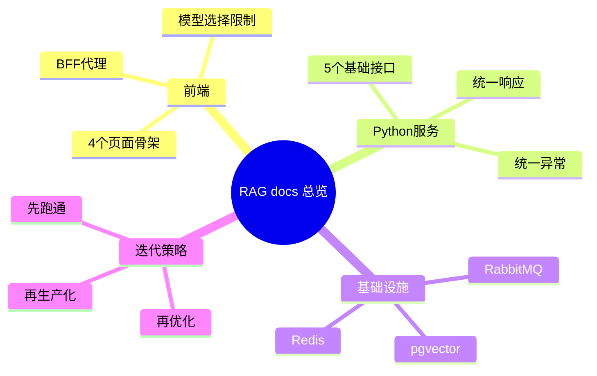

# RAG 项目文档总览（Next.js + Python）

主公，这一版是重开后的文档入口，先按这个顺序看。

## 1. 文档与目录映射

| 项目目录 | 对应文档 | 说明 |
| --- | --- | --- |
| `frontend/` | `docs/frontend/` | Next.js 前端与 BFF 层 |
| `python-service/` | `docs/backend/` | FastAPI 文档解析、切割、检索编排 |
| `docs/infra/` | `docs/infra/` | PostgreSQL+pgvector、Redis、RabbitMQ |
| `docs/plan/` | `docs/plan/总体蓝图.md` | 架构总图 |
| `docs/roadmap/` | `docs/roadmap/阶段计划.md` | 阶段拆解与验收 |

## 2. 建议阅读顺序

1. `docs/plan/总体蓝图.md`
2. `docs/frontend/README.md`
3. `docs/frontend/2026-02-28-前端初始版本落地.md`
4. `docs/frontend/2026-02-28-端口调整-8081.md`
5. `docs/backend/README.md`
6. `docs/backend/2026-02-28-python-service-初始版本.md`
7. `docs/backend/2026-02-28-后端端口调整-8090.md`
8. `docs/backend/python-fastapi-协作规范.md`
9. `docs/backend/2026-02-28-token可观测性-后端落地.md`
10. `docs/frontend/2026-02-28-token可观测性-前端落地.md`
11. `docs/infra/postgresql-pgvector.md`
12. `docs/infra/redis-rabbitmq.md`
13. `docs/infra/2026-02-28-observability-日志表结构升级.md`
14. `docs/backend/2026-03-01-observability-查询筛选增强.md`
15. `docs/frontend/2026-03-01-消耗日志筛选与导出.md`
16. `docs/frontend/2026-03-01-模型编辑回填修复.md`
17. `docs/infra/2026-03-01-observability-筛选索引优化.md`
18. `docs/backend/2026-03-01-模型详情接口补充.md`
19. `docs/frontend/2026-03-01-模型编辑改为详情接口回填.md`
20. `docs/backend/2026-03-01-文档切分策略可选与上传提速.md`
21. `docs/frontend/2026-03-01-文档切分策略可选与上传提速.md`
22. `docs/backend/2026-03-01-父子文档切分策略接入.md`
23. `docs/frontend/2026-03-01-父子文档切分策略接入.md`
24. `docs/backend/2026-03-01-父召回子精排检索落地.md`
25. `docs/backend/2026-03-01-文档Worker父子元数据落库.md`
26. `docs/backend/2026-03-01-ask-stream连接生命周期修复.md`
27. `docs/backend/2026-03-01-ask-stream消耗日志补齐.md`
28. `docs/backend/2026-03-01-文档已选但无上下文召回兜底.md`
29. `docs/backend/2026-03-01-mcp双轨插件与深度思考落地.md`
30. `docs/frontend/2026-03-01-聊天插件开关与MCP设置页.md`
31. `docs/infra/2026-03-01-mcp与深度思考表结构升级.md`
32. `docs/roadmap/阶段计划.md`

## 3. 当前策略

- 先把前后端链路跑通：页面可用、接口可调、数据结构稳定。
- 前端先走 Next.js BFF，后端先给 FastAPI 基础能力。
- 先可用，再补异步任务、向量检索和生产化能力。

## 4. 实现思考

- 首版重点是“可协作开发”，不是一开始就做复杂抽象。
- 模型能力边界要前后端双校验，避免越权调用。
- 文档处理先做可视化预览，减少调参盲区。

## 5. 思维导图

