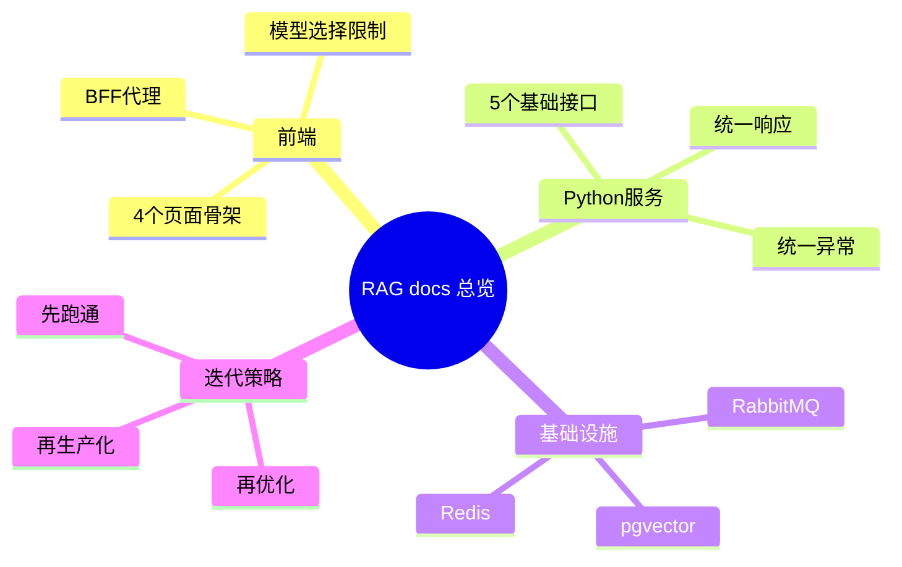

# RAG 项目文档总览（Next.js + Python）

主公，这一版是重开后的文档入口，先按这个顺序看。

## 1. 文档与目录映射

| 项目目录 | 对应文档 | 说明 |
| --- | --- | --- |
| `frontend/` | `docs/frontend/` | Next.js 前端与 BFF 层 |
| `python-service/` | `docs/backend/` | FastAPI 文档解析、切割、检索编排 |
| `docs/infra/` | `docs/infra/` | PostgreSQL+pgvector、Redis、RabbitMQ |
| `docs/plan/` | `docs/plan/总体蓝图.md` | 架构总图 |
| `docs/roadmap/` | `docs/roadmap/阶段计划.md` | 阶段拆解与验收 |

## 2. 建议阅读顺序

1. `docs/plan/总体蓝图.md`
2. `docs/frontend/README.md`
3. `docs/frontend/2026-02-28-前端初始版本落地.md`
4. `docs/frontend/2026-02-28-端口调整-8081.md`
5. `docs/backend/README.md`
6. `docs/backend/2026-02-28-python-service-初始版本.md`
7. `docs/backend/2026-02-28-后端端口调整-8090.md`
8. `docs/backend/python-fastapi-协作规范.md`
9. `docs/infra/postgresql-pgvector.md`
10. `docs/infra/redis-rabbitmq.md`
11. `docs/roadmap/阶段计划.md`

## 3. 当前策略

- 先把前后端链路跑通：页面可用、接口可调、数据结构稳定。
- 前端先走 Next.js BFF，后端先给 FastAPI 基础能力。
- 先可用，再补异步任务、向量检索和生产化能力。

## 4. 实现思考

- 首版重点是“可协作开发”，不是一开始就做复杂抽象。
- 模型能力边界要前后端双校验，避免越权调用。
- 文档处理先做可视化预览，减少调参盲区。

## 5. 思维导图

