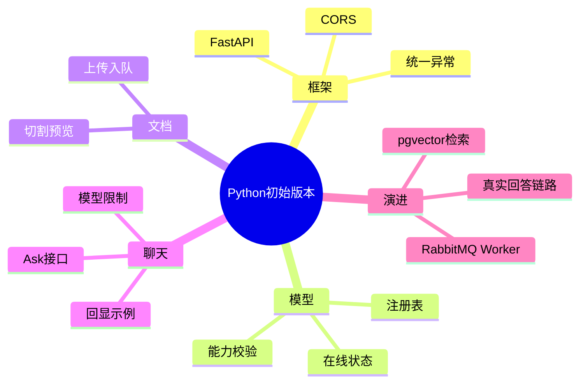

# 2026-02-28 Python Service 初始版本记录

## 1. 本次做了什么

1. 初始化 FastAPI 工程骨架。
2. 落地统一响应结构和统一异常处理。
3. 落地 5 个基础接口：
   - `GET /api/v1/health`
   - `GET /api/v1/models`
   - `POST /api/v1/chat/ask`
   - `POST /api/v1/documents/upload`
   - `POST /api/v1/documents/split-preview`
4. 落地模型注册表（内存版），给前端模型管理和聊天选择提供数据。

## 2. 关键实现细节

- `app/main.py`
  - 挂载 CORS
  - 挂载统一异常处理（422/HTTPException/500）
- `app/domain/models_registry.py`
  - 统一管理模型能力与状态
  - 提供 `model_supports` 校验函数
- `chat.py`
  - 强制校验 `modelId` 是否支持 `chat`
- `documents.py`
  - 上传接口先做“入队确认”形态
  - 切割预览按 `chunkSize/overlap` 做滑窗切割

## 3. CQRS 思路怎么体现

- 命令（Command）：
  - `POST /api/v1/chat/ask`
  - `POST /api/v1/documents/upload`
- 查询（Query）：
  - `GET /api/v1/health`
  - `GET /api/v1/models`
  - `POST /api/v1/documents/split-preview`（本质是计算型查询，不落库）

## 4. 为什么这么做（思考）

- 先给前端可稳定依赖的契约，避免页面开发被阻塞。
- 模型能力校验放后端兜底，防止前端绕过限制。
- 上传先返回任务 ID，后续接 MQ 不需要重做接口。

## 5. 下一步建议

- 接入真实模型配置（数据库表 + 管理接口）。
- 接入 RabbitMQ Worker，补任务状态查询。
- 接入 pgvector，替换聊天回显为真实检索回答。

## 6. 思维导图

