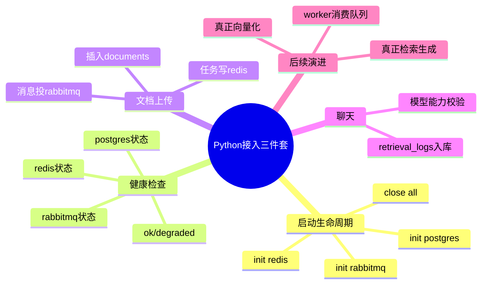

# 2026-02-28 Python Service 接入 PostgreSQL、Redis、RabbitMQ

## 1. 这次做了什么

主公，这一轮把 Python 服务和基础设施三件套真正接上了，不再只是“接口回显”：

1. 启动 FastAPI 时自动初始化 PostgreSQL、Redis、RabbitMQ。
2. 健康检查接口增加三件中间件状态返回。
3. 文档上传接口改成真实链路：
   - 写 PostgreSQL `documents`
   - 写 Redis 任务状态
   - 投递 RabbitMQ 任务消息
4. 聊天接口补了 `retrieval_logs` 入库，后续方便查链路和效果。

## 2. 改了哪些文件

1. `python-service/app/main.py`
2. `python-service/app/core/config.py`
3. `python-service/app/core/database.py`
4. `python-service/app/core/redis_client.py`（新增）
5. `python-service/app/core/rabbitmq.py`（新增）
6. `python-service/app/api/v1/endpoints/health.py`
7. `python-service/app/api/v1/endpoints/documents.py`
8. `python-service/app/api/v1/endpoints/chat.py`
9. `python-service/app/domain/vector_store.py`
10. `python-service/app/domain/models_registry.py`
11. `python-service/requirements.txt`
12. `python-service/README.md`
13. `python-service/.env.example`（新增）

## 3. 关键实现细节（大白话）

### 3.1 启动与关闭

- `main.py` 里用了 FastAPI `lifespan`：
  - 启动时：`init_database()`、`init_redis()`、`init_rabbitmq()`
  - 关闭时：按反向顺序释放连接

### 3.2 健康检查

- `GET /api/v1/health` 现在会返回：
  - `postgres` 是否可用
  - `redis` 是否可用
  - `rabbitmq` 是否可用
- 总状态：
  - 全部正常是 `ok`
  - 任一异常是 `degraded`

### 3.3 文档上传真实链路

- `POST /api/v1/documents/upload` 现在流程：
  1. 生成 `taskId`
  2. 插入 PostgreSQL `documents`
  3. 发布 RabbitMQ 队列消息（默认 `documents.upload`）
  4. Redis 记录任务状态（默认 1 小时 TTL）

### 3.4 聊天日志

- `POST /api/v1/chat/ask` 会把提问记录写到 `retrieval_logs`（MVP 先记基础字段）。

### 3.5 向量存储层对齐

- `vector_store.py` 的 SQL 字段已对齐当前数据库表结构，避免后续接检索时字段对不上。

## 4. 环境变量补齐

新增了三件套配置：

1. PostgreSQL：`POSTGRES_*`
2. Redis：`REDIS_*`
3. RabbitMQ：`RABBITMQ_*`

示例已放到：`python-service/.env.example`

## 5. 这轮思考

1. 先把“连接 + 健康 + 最小业务落库”做稳，后面接 Worker 和真实 RAG 检索才不会返工。
2. 文档上传链路已经具备任务化基础，接消费者时不用改接口协议。
3. 聊天日志先入库，后面做效果评估和排障会省很多时间。

## 6. 思维导图

