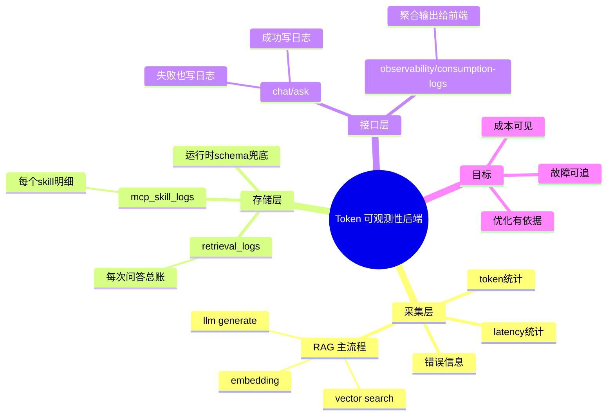

# 2026-02-28 Token 可观测性后端落地（Prompt + MCP Skill）

主公，这次后端改造目标很直接：每次问答都要能看到 Token 消耗，而且能拆到每个 MCP Skill 调用（embedding / vector search / llm）。

## 1. 这次改了啥

- 改了 `python-service/app/domain/rag_service.py`
  - 给 RAG 主流程加了 `skill_calls` 记录。
  - 每一步都记：`skill_name`、`status`、`latency_ms`、`token`、输入输出摘要、异常信息。
  - 新增 `RAGExecutionError`，失败时把已收集到的可观测信息一起抛出去，避免失败就丢日志。
- 改了 `python-service/app/api/v1/endpoints/chat.py`
  - 成功路径：写 `retrieval_logs` 主日志，再写 `mcp_skill_logs` 明细。
  - 失败路径：同样写日志（状态 `failed`），保证故障也可追踪。
- 新增 `python-service/app/api/v1/endpoints/observability.py`
  - 提供 `GET /api/v1/observability/consumption-logs?limit=50`。
  - 返回每次请求的 token + MCP skill 调用明细，给前端直接展示。
- 改了 `python-service/app/api/v1/router.py`
  - 挂载了 observability 路由。
- 改了 `python-service/app/core/database.py`
  - 增加运行时 schema 兜底：旧库启动时会自动补齐新字段和新表。

## 2. 表结构怎么落地

这次把日志拆成主表 + 明细表：

- 主表 `retrieval_logs`：一条问答一行
  - `prompt_tokens / completion_tokens / total_tokens`
  - `mcp_call_count`
  - `status`（success/failed）
  - `error_message`
  - `model_id`
- 明细表 `mcp_skill_logs`：一个 skill 调用一行
  - 通过 `retrieval_log_id` 关联主表
  - 记录每个 skill 的耗时、token、输入输出摘要、异常

这样做的好处是：

- 看总账快：查主表就知道这次问答花了多少 token。
- 查明细准：展开明细就知道是 embedding 慢了还是 llm 慢了。

## 3. 为什么要做运行时兜底

`infra/postgres/init/001_init_schema.sql` 只在数据库首次初始化时执行。  
如果主公本地数据库已经跑起来了，只改 init SQL 不会自动生效。

所以在 `database.py` 启动阶段补了：

- `CREATE TABLE IF NOT EXISTS retrieval_logs`
- `ALTER TABLE ... ADD COLUMN IF NOT EXISTS ...`
- `CREATE TABLE IF NOT EXISTS mcp_skill_logs`
- `CREATE INDEX IF NOT EXISTS ...`

这样旧环境重启服务就能吃到新 schema，不用手工改库。

## 4. 失败场景怎么保证有日志

以前问题是：一旦中途异常，日志就可能没写完。  
现在做法：

- RAG 内部失败抛 `RAGExecutionError`，把已采集的 token/skill 信息带出来。
- `chat.py` 捕获后也会入库，状态标记为 `failed`。

效果是：哪怕问答报错，仍然能在消耗日志页面看到这次请求和失败点。

## 5. 接口返回结构（给前端）

`GET /api/v1/observability/consumption-logs`

- `items[]` 每条包含：
  - 问题、模型、token、耗时、状态、错误、引用、创建时间
  - `skillCalls[]`：每个 MCP skill 的明细
- `total`：返回条数

## 6. 小赵的实现思考

- 先保证“失败不丢日志”，再追求“展示好看”。
- 主表和明细表拆开，是为了后面做统计报表时不痛苦。
- 先把 `limit` 做好，避免日志多了接口拖垮页面。

## 7. 思维导图

