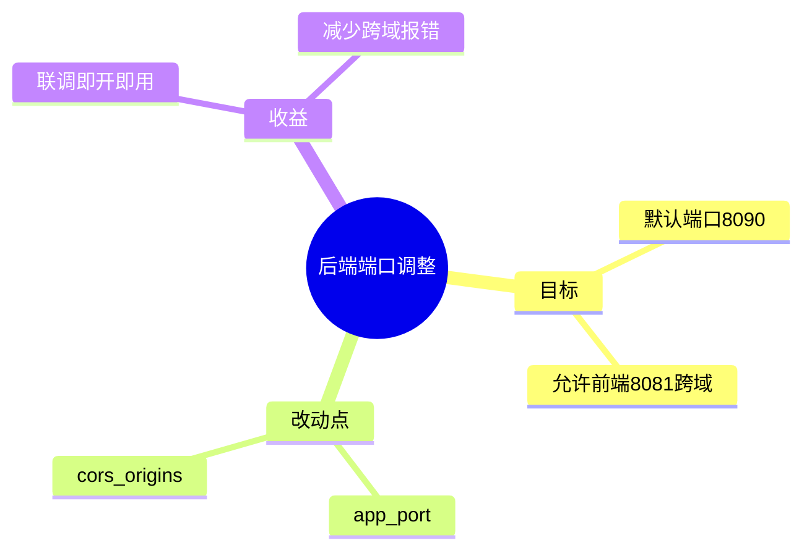

# 2026-02-28 后端端口调整（8090）

## 1. 本次改动

- FastAPI 默认端口从 `8000` 改为 `8090`。
- CORS 默认来源从 `http://localhost:3000` 改为 `http://localhost:8081`。

## 2. 改动文件

- `python-service/app/core/config.py`
  - `app_port: 8090`
  - `cors_origins: http://localhost:8081`

## 3. 为什么这么改（大白话）

- 主公指定后端改到 8090，前后端端口要同步规划。
- 默认 CORS 不改会出现跨域拦截，所以一起改为 8081。
- 先把默认值写死成新规范，减少本地开发沟通成本。

## 4. 思维导图

