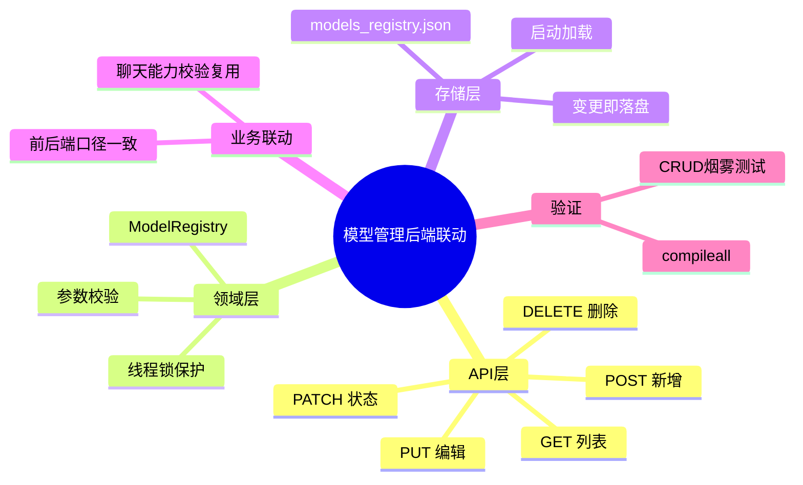

# 2026-02-28 模型管理前后端联动（后端落地）

主公，这次后端把模型管理从“写死常量”改成“可增删改查 + 持久化文件”。

## 1. 这次后端改了什么

- 模型接口从只读升级为完整 CRUD。
- 模型注册表从内存常量改成 JSON 文件持久化。
- 模型配置结构增加 `baseUrl` 和 `apiKey` 字段，支持前端新增/编辑填写。
- 聊天接口继续复用同一份注册表做 `chat` 能力校验，保证前后端口径一致。

## 2. 改了哪些后端文件

- `python-service/app/api/v1/endpoints/models.py`
- `python-service/app/domain/models_registry.py`
- `python-service/app/core/config.py`
- `python-service/data/models_registry.json`

## 3. 关键实现细节（大白话）

### 3.1 模型接口补齐

- 保留：`GET /api/v1/models`
- 新增：
  - `POST /api/v1/models`（新增模型）
  - `PUT /api/v1/models/{model_id}`（更新模型）
  - `PATCH /api/v1/models/{model_id}/status`（只改状态）
  - `DELETE /api/v1/models/{model_id}`（删除模型）

### 3.2 持久化注册表

- 新增文件：`python-service/data/models_registry.json`。
- 服务启动时会读这个文件；文件不存在或坏掉时自动回退默认模型并重建。
- 每次新增、编辑、启停、删除都会立即写回 JSON，重启后仍然保留。

### 3.3 统一校验规则

- 模型 ID：仅允许字母、数字和 `.-_:`，长度 2-64。
- 能力标签：只允许 `chat/embedding/rerank`。
- 状态：只允许 `online/offline`。
- `maxTokens`：限制在 256 到 10000000，避免脏数据写入。
- `baseUrl/apiKey`：长度做上限校验，避免异常超长配置污染数据。

## 4. 验证结果

已执行：

- `cd python-service && .venv/bin/python -m compileall app`
- `cd python-service && .venv/bin/python` 运行注册表 CRUD 烟雾脚本（新增->编辑->启停->删除）

结果：

- Python 编译通过。
- 模型注册表 CRUD 流程通过。
- 数据文件读写正常。

## 5. 小赵的思考

- 这版先用 JSON 持久化，成本低、改动小，够支撑当前联调。
- 后续接 PostgreSQL 时，只要替换 `models_registry` 存储实现，接口层可以不动。
- 前端模型管理和聊天模型校验都走同一份数据源，能减少“页面显示和实际可用不一致”的问题。

## 6. 思维导图

## 7. 常见问题排查（501）

- 如果 `DELETE /api/v1/models/{id}` 返回 `501`，先检查 `RAG_PYTHON_URL` 指向的是不是 FastAPI。
- 用 `curl -i http://127.0.0.1:8090/api/v1/models` 看响应头：
  - 若是 `Server: uvicorn`，说明是对的。
  - 若是 `Server: BaseHTTP/...`，说明连到了 mock/http.server，不是这套 Python Service。
