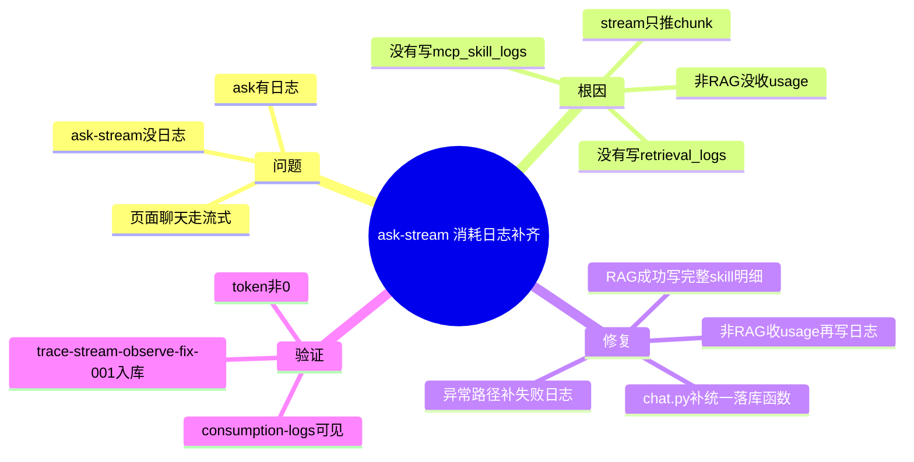

# 2026-03-01 ask-stream 消耗日志补齐

主公，这次修的是一个很实在的问题：前端聊天默认走 `ask-stream`，但之前只在 `ask` 里写消耗日志，导致你在页面里聊完看不到统计。

## 1. 现象

- 页面聊天正常有回复。
- 但 `消耗日志` 菜单里看不到这次对话，或者 token 一直是 0。
- 非流式 `POST /api/v1/chat/ask` 有日志，流式 `POST /api/v1/chat/ask-stream` 缺日志。

## 2. 根因（大白话）

- 代码里 `ask` 有 `_write_retrieval_log` 和 `_write_skill_logs`。
- `ask-stream` 以前只管推 SSE chunk，没有把这次调用的统计信息写入 `retrieval_logs/mcp_skill_logs`。
- 非 RAG 流式还缺一个点：token usage 在流末尾 chunk 才拿得到，之前也没收集。

## 3. 这次改了什么

改动文件：`python-service/app/api/v1/endpoints/chat.py`

- 给 `ask-stream` 增加统一的 `persist_observability_logs(...)`，复用现有日志写表函数。
- `useRag=true`：
  - 调完 `rag_service.ask(...)` 后，立刻写 `retrieval_logs` 和 `mcp_skill_logs`。
  - 成功日志包含检索引用、token、skill 明细（embedding/vector/llm）。
- `useRag=false`：
  - 用 `chat_only_stream(..., usage_sink=...)` 收集流结束的 usage。
  - 回答结束后写 `mcp.llm.generate` skill 日志 + retrieval 总日志。
- 异常路径：
  - `RAGExecutionError`、`HTTPException`、通用异常都会尝试落失败日志。
  - 非 RAG 异常时会补一条 `mcp.llm.generate failed`，避免“失败但没明细”。

## 4. 联动改动

改动文件：`python-service/app/domain/rag_service.py`

- `chat_only_stream(...)` 新增 `usage_sink` 参数。
- 优先请求 `stream_options={"include_usage": True}`，不支持则自动回退到普通流。
- 在流结束时把 `prompt/completion/total` 写回 `usage_sink`，供 `ask-stream` 落库。

## 5. 验证结果

- 实测请求：`trace-stream-observe-fix-001`（`useRag=false`）。
- `retrieval_logs` 已新增成功记录，token 非 0。
- `mcp_skill_logs` 已新增 `mcp.llm.generate` 成功记录，含 latency 与 token。
- `GET /api/v1/observability/consumption-logs` 可看到该条流式会话。

## 6. 小赵的实现思考

- 流式接口不是“只发 chunk”，它同样是一次完整调用，必须和非流式拥有同级可观测性。
- 日志写入放在“业务完成后/异常捕获里”最稳，不会干扰前端收流。
- usage 采集一定要考虑模型兼容：支持就拿精确值，不支持也保证链路可用。

## 7. 思维导图

