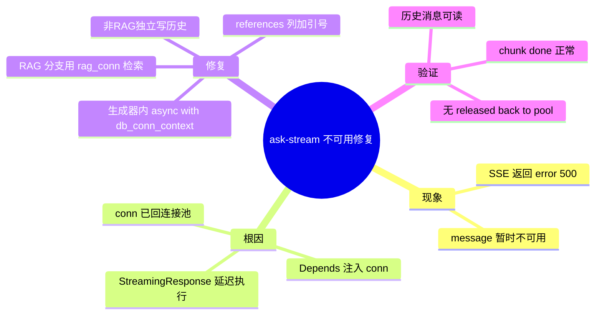

# 2026-03-01 ask-stream 连接生命周期修复

主公，这次不是模型不可用，也不是文档 ID 错了，核心是后端流式接口把数据库连接提前释放了。

## 1. 现象（你看到的“不可用”）

- 调用 `POST /api/v1/chat/ask-stream`（`useRag=true`）会收到：
  - `event: error`
  - `message: 问答服务暂时不可用，请稍后重试`
  - `code: 500`

## 2. 根因（大白话）

- 流式接口用 `Depends(get_optional_db_conn)` 注入了 `conn`。
- 但 `StreamingResponse` 真正开始执行 `event_generator` 时，请求依赖生命周期已经结束。
- 结果就是：`rag_service.ask()` 里还在用这个 `conn` 做向量检索，但连接已经回池。
- 所以抛错：`cannot call Connection.fetch(): connection has been released back to the pool`。

## 3. 这次怎么改

改动文件：`python-service/app/api/v1/endpoints/chat.py`

- `ask-stream` 不再把 DB 连接作为依赖参数传进来。
- 在流式生成器内部，RAG 分支改成 `async with db_conn_context() as rag_conn`，确保检索期间连接有效。
- 非 RAG 分支在回答完成后再尝试独立写聊天历史，DB 不可用时只记日志，不影响返回。
- 顺手修了 `chat_messages` 的 SQL 关键字问题：
  - `references` 列统一改成 `"references"`（带引号），避免 PostgreSQL 语法报错。

## 4. 验证结果

- 复测同一条请求（`useRag=true + documentIds`）后，SSE 正常返回 `chunk` 和 `done`。
- 不再出现 `connection has been released back to the pool`。
- 聊天历史接口 `GET /api/v1/chat/sessions/{sessionId}/messages` 可正常返回消息。

## 5. 小赵的实现思考

- 流式接口里，任何需要长期使用的资源（DB 连接、文件句柄）都不能靠请求依赖直接跨到生成器里用。
- 正确做法是“资源跟着生成器走”，在生成器内部自己开关连接。
- 这样错误边界清楚：RAG 检索失败和连接生命周期问题分得开，排查会快很多。

## 6. 思维导图

