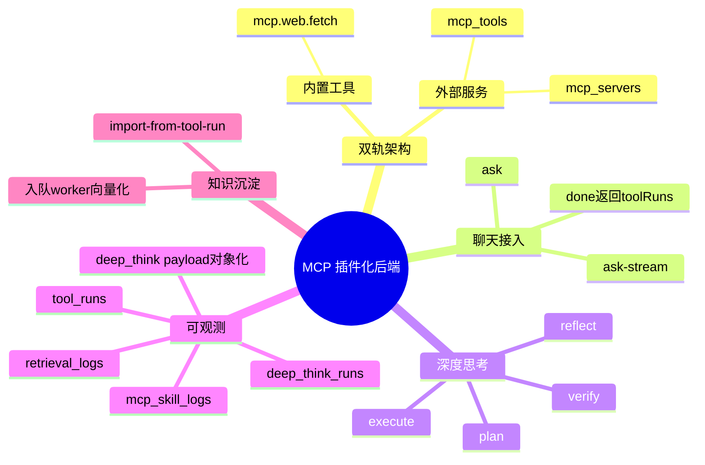

# 2026-03-01 MCP 双轨插件与深度思考落地

主公，这次是把“插件能力”从想法变成可跑链路：聊天里能自动调网页插件，还能开深度思考四阶段。

## 1. 这次解决了什么

- 聊天接口支持插件自动调用，不再只有 `embedding/search/llm` 三步。
- 插件不是单轨，做了两条路：
  - 内置路：后端直接实现工具（先上网页抓取）。
  - 外部路：可以配置外部 MCP Server（HTTP 方式）给后面扩展。
- 深度思考不是一句 prompt，而是 `plan -> execute -> reflect -> verify` 四阶段。
- 可观测不只看 token，还能看到每次工具运行和每个深度思考阶段。
- 增加“工具结果一键入库文档”接口，网页抓取内容可以转知识库。

## 2. 主要改动文件

- `python-service/app/core/database.py`
- `python-service/app/core/config.py`
- `python-service/app/api/v1/endpoints/chat.py`
- `python-service/app/api/v1/endpoints/mcp.py`
- `python-service/app/api/v1/endpoints/observability.py`
- `python-service/app/api/v1/endpoints/documents.py`
- `python-service/app/api/v1/router.py`
- `python-service/app/domain/mcp/registry.py`
- `python-service/app/domain/mcp/gateway.py`
- `python-service/app/domain/tools/orchestrator.py`
- `python-service/app/domain/tools/builtin_web_fetch.py`
- `python-service/app/domain/tools/deep_think_pipeline.py`
- `python-service/.env.example`

## 3. 数据库新增（运行时自动兜底建表）

- `mcp_servers`：外部 MCP Server 配置。
- `mcp_tools`：工具注册表（builtin/external）。
- `tool_runs`：每次工具调用明细。
- `deep_think_runs`：深度思考每个阶段的运行记录。

说明：
- 都是 `CREATE TABLE IF NOT EXISTS`，老库能平滑升级。
- 保留了原有 `retrieval_logs/mcp_skill_logs`，兼容旧看板。

## 4. 聊天链路怎么接的

- `POST /api/v1/chat/ask`
  - 先走 `ToolOrchestrator`（按开关决定是否调工具/深思）。
  - 再走原有 `rag_service.ask` 或 `rag_service.chat_only`。
  - 回包增加：
    - `toolRuns`
    - `deepThinkSummary`
    - `deepThinkRuns`
- `POST /api/v1/chat/ask-stream`
  - 同样先编排工具，再流式回答。
  - `done` 事件里也带上 `toolRuns/deepThinkSummary/deepThinkRuns`。

## 5. 插件能力当前状态（可用）

- 内置工具：`mcp.web.fetch`
  - 能抓网页标题和正文摘要。
  - 带基础 SSRF 防护（内网地址禁止访问）。
  - 本地开发遇到证书链问题时会自动降级重试一次（只在证书失败时触发）。
- 深度思考：`mcp.deep_think.pipeline`
  - 输出四阶段记录，供前端展示和审计。
- 外部 MCP Server
  - 已有服务端配置接口和调用网关。
  - 通过 `mcp_servers` + `mcp_tools` 管理。

## 6. 新接口

- `GET /api/v1/mcp/servers`
- `POST /api/v1/mcp/servers`
- `PATCH /api/v1/mcp/servers/{server_key}`
- `POST /api/v1/mcp/servers/{server_key}/sync-tools`
- `GET /api/v1/mcp/tools`
- `PATCH /api/v1/mcp/tools/{tool_name}/status`
- `GET /api/v1/observability/tool-runs`
- `GET /api/v1/observability/deep-think-runs`
- `POST /api/v1/documents/import-from-tool-run`

## 6.1 外部工具同步机制（新补充）

- 现在可以对某个外部 Server 触发 `sync-tools`。
- 同步时会请求外部服务：
  - `POST {endpoint}`
  - body: `{"op":"list_tools"}`
- 支持两种工具字段风格：
  - `toolName/displayName/toolSchema`
  - `name/title/schema`
- 同步结果会：
  - 把返回工具 upsert 到 `mcp_tools`（`source=external`）
  - 对该 server 下“这次没返回”的旧工具自动 `enabled=false`

## 6.2 观测接口数据类型修正（补充）

- 问题现象：
  - `GET /api/v1/observability/deep-think-runs` 在部分环境下会把 `payload` 返回成字符串。
  - 前端要当对象用时，需要额外再 `JSON.parse`，体验不一致。
- 修正方式：
  - 后端统一用 `_parse_json_object` 处理 `deep_think_runs.payload`。
  - 现在接口稳定返回对象，和 `tool-runs.outputPayload` 对齐。
- 实际收益：
  - 前端展示深度思考阶段详情不再受数据库解码差异影响。
  - 后面做导出、过滤、统计更稳定。

## 7. 我这次的思考

- 先保证“可运行 + 可观测 + 可回滚”，再做更重的协议细节。
- 双轨先搭框架很关键，后面换 MCP SDK 或换 transport 成本会小很多。
- 深度思考这版先把阶段化和日志先做出来，后面再加强每阶段的模型策略。

## 8. 验证结果

- 编译通过：`python3 -m compileall app`
- BFF 联调通过（8081 代理）：
  - `POST /api/v1/mcp/servers/mock-sync/sync-tools`
  - `GET /api/v1/mcp/tools`
  - `GET /api/v1/observability/tool-runs`
  - `GET /api/v1/observability/deep-think-runs`
  - `POST /api/v1/documents/import-from-tool-run`
- 非流式成功：
  - `trace-mcp-web-ask-001` 可看到网页工具成功 + 深思阶段日志。
- 流式成功：
  - `trace-mcp-web-stream-003` 可看到 `done` 里工具调用信息。
- 新流式回查成功：
  - `trace-obsv-*` 可在 `consumption-logs` 查到 prompt/completion/total token 与 `mcp.llm.generate`。
- 日志落库：
  - `retrieval_logs`、`mcp_skill_logs`、`tool_runs`、`deep_think_runs` 都有数据。
- 一键入库可用：
  - `POST /api/v1/documents/import-from-tool-run` 返回 `queued` 并入 RabbitMQ。

## 9. 思维导图

