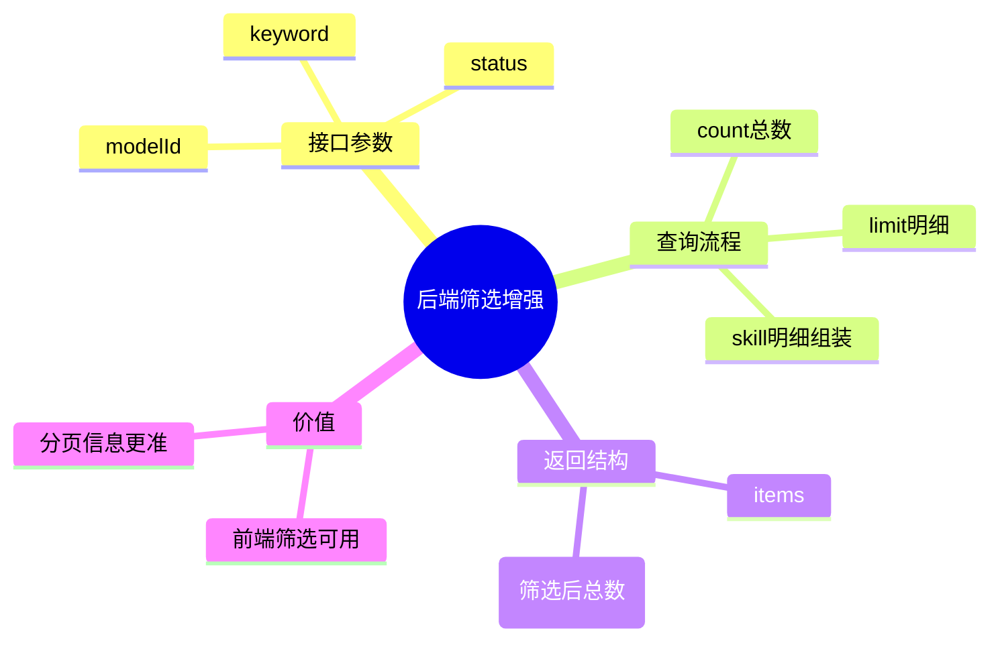

# 2026-03-01 可观测日志查询筛选增强（后端）

主公，这一版后端主要做两件事：  
1) 给消耗日志接口加筛选参数；2) 把返回的 `total` 改成“筛选后的总数”。

## 1. 改了哪些点

- 文件：`python-service/app/api/v1/endpoints/observability.py`
  - `GET /api/v1/observability/consumption-logs` 新增参数：
    - `modelId`：按模型筛选
    - `status`：按请求状态筛选（`success` / `failed`）
    - `keyword`：按问题内容模糊匹配
  - 查询逻辑变成动态 `WHERE` 条件拼装（参数化，不是字符串直拼值）。
  - 返回结构里的 `total` 改成“当前筛选条件下的总条数”，不是当前页条数。

## 2. 为什么要这样改

- 前端做筛选时需要知道“总共匹配了多少条”，不然只能看到当前拉取的 `limit` 条。
- 之前 `total=len(items)`，一旦 `limit=50`，就看不出后面还有多少数据。

## 3. 关键实现思路

- 先跑 `COUNT(*)` 统计筛选总数。
- 再跑明细查询，按 `created_at DESC` 拉最新 `limit` 条。
- Skill 明细仍按 `retrieval_log_id` 批量查询并组装。

## 4. 小赵思考

- 先把筛选做在后端，避免前端一次拉全量再本地筛，浪费网络和内存。
- 关键字目前先用 `question ILIKE`，后续如果日志量大可换全文检索。

## 5. 思维导图

