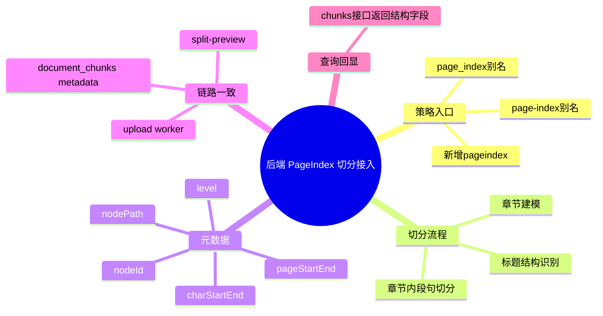

# 2026-03-01 PageIndex 切分策略接入（后端）

主公，这一版后端把 `pageindex` 切分策略正式落地，目标是让“按章节结构切分 + 元数据可回溯”真正可用。

## 1. 这次改了哪些文件

1. `python-service/app/api/v1/endpoints/documents.py`
2. `python-service/app/workers/document_worker.py`

## 2. 实现细节（大白话）

### 2.1 策略入口补齐

- `SUPPORTED_SPLIT_STRATEGIES` 新增 `pageindex`。
- 策略别名新增：`page-index`、`page_index`，统一归一到 `pageindex`。
- 这样前端传不同写法也不会炸。

### 2.2 PageIndex 切分核心逻辑

新增了三层处理：

1. **结构识别**：识别 Markdown 标题、数字标题（如 `1.2.3`）、中文章节标题（如 `第一章`）。
2. **章节建模**：为每个章节生成 `nodeId/nodePath/level/pageStart/pageEnd`。
3. **章节内切块**：章节内部按“段落优先，句子兜底，再字数兜底”生成 chunks。

这样每个 chunk 不再是“纯碎片”，而是知道自己属于哪个结构节点。

### 2.3 预览和上传链路一致

- `POST /documents/split-preview` 传 `strategy=pageindex` 时，返回 chunk 会包含：
  - `nodeId`
  - `nodePath`
  - `level`
  - `pageStart/pageEnd`
  - `charStart/charEnd`
  - `sectionTitle`
- Worker 消费上传任务时，同样用 `_split_text(..., strategy=pageindex)`。

也就是说：预览怎么切，上传入库就怎么切，不会“预览一套、落库一套”。

### 2.4 元数据真正落库

Worker 的 `_build_chunk_metadata` 现在会把 PageIndex 字段写入 `document_chunks.metadata`，后续检索和引用展示都能直接拿这些结构信息。

### 2.5 分块查询接口补齐回显

`GET /documents/{documentId}/chunks` 现在会把上述结构元数据原样回给前端，方便在“查看分块”里直接看章节路径与页码信息。

## 3. 小赵两轮思考

### 第一轮：先做“策略可选”

先把入口补齐（策略枚举、别名、路由复用），保证 PageIndex 策略能被稳定调用。

### 第二轮：再做“可解释落地”

只切分不够，必须把 `nodePath/page` 这类信息落入 chunk metadata，不然前端和检索都吃不到结构价值。

## 4. 验证结果

已执行：

- `python3 -m compileall python-service/app/api/v1/endpoints/documents.py python-service/app/workers/document_worker.py`

结果：

- 编译通过，无语法错误。

## 5. 思维导图

