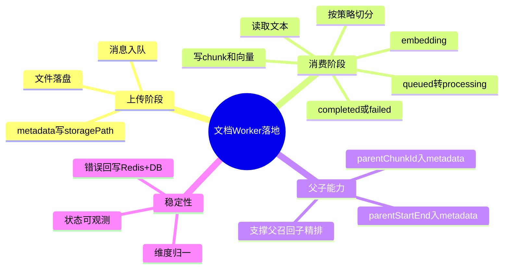

# 2026-03-01 文档 Worker 父子元数据落库（后端）

主公，这一版把“只入队不消费”的缺口补齐了。现在上传后会真的被 Worker 消费、切分、向量化、入库。

## 1. 这次改了哪些文件

1. `python-service/app/workers/document_worker.py`（新增）
2. `python-service/app/workers/__init__.py`（新增）
3. `python-service/app/main.py`
4. `python-service/app/api/v1/endpoints/documents.py`
5. `python-service/app/domain/vector_store.py`
6. `python-service/app/core/config.py`
7. `python-service/.env.example`
8. `python-service/README.md`

## 2. 实现细节（大白话）

### 2.1 上传现在先落盘，再入队

- `upload` 接口不只是写一条队列消息了。
- 现在会先把文件保存到 `data/uploads`，再把 `storagePath` 一起写进：
  - `documents.metadata`
  - RabbitMQ 消息体
- 这样 Worker 才拿得到真实文件，不会“队列有任务，但没有文件可处理”。

### 2.2 Worker 真实消费队列

- 新增 `DocumentWorker`，开机自动启动，关机自动停止。
- 消费队列：`documents.upload`。
- 消费流程：
  1. 任务状态 `queued -> processing`
  2. 读取文件内容（先支持 txt/md/csv/json 文本类）
  3. 按策略切分（含 `parent_child`）
  4. 逐块做 embedding
  5. 写入 `document_chunks + chunk_embeddings`
  6. 文档状态更新为 `completed` 或 `failed`

### 2.3 父子元数据现在真的写进 chunk

- 之前只是预览接口有父子字段。
- 现在 Worker 入库时会把这些字段写到 `document_chunks.metadata`：
  - `parentChunkId`
  - `parentStart`
  - `parentEnd`
  - `parentLength`
- 这一步是“父召回子精排”能在真实数据上生效的关键。

### 2.4 维度兼容补丁

- 遇到 embedding 维度和库表不一致（比如 3072 vs 1536）会直接失败。
- 现在在 `vector_store` 做了统一处理：
  - 过长截断
  - 过短补 0
- 配置项：`VECTOR_DIMENSION`（默认 1536）。

### 2.5 任务可观测性

- Worker 会把结果写回：
  - Redis 任务键（状态、错误、chunk 数）
  - documents.metadata（chunkCount、embeddingModelId、token 统计、error）

## 3. 小赵两轮思考

### 第一轮：先补“真消费”

- 不先做抽象，先确保消息有人吃、文件能处理、状态能流转。
- 先把端到端链路闭环，避免继续“看起来接了队列，其实没跑”。

### 第二轮：再补“线上能跑稳”

- 把维度不一致、文本解码、失败回写这几块补齐。
- 目标是失败可见、可排查，不是静默失败。

## 4. 思维导图

