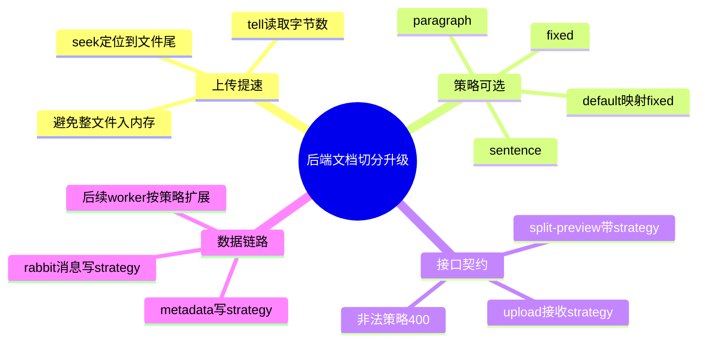

# 2026-03-01 文档切分策略可选与上传提速（后端）

主公，这一版后端重点做了两件事：

- 解决“上传慢”的问题：不再为了算文件大小把整个文件读进内存。
- 解决“切分策略单一”的问题：切分预览和上传都支持策略参数。

## 1. 这次改了哪些文件

1. `python-service/app/api/v1/endpoints/documents.py`

## 2. 实现细节（大白话）

### 2.1 上传提速：文件大小改成 `seek/tell`

- 旧逻辑常见问题：`await file.read()` 先把整文件读出来再算大小，文件一大就慢。
- 新逻辑：
  - `file.file.seek(0, 2)` 定位到文件尾
  - `file.file.tell()` 拿到字节数
  - `file.file.seek(0)` 回到开头
- 这样不需要把全量内容读到内存，上传入口更轻。

### 2.2 切分策略统一参数化

- `SplitPreviewRequest` 新增 `strategy` 字段，默认 `fixed`。
- 上传接口 `POST /documents/upload` 新增表单字段 `strategy`，默认 `fixed`。
- 新增策略归一化：
  - `default -> fixed`
  - 支持：`fixed`、`sentence`、`paragraph`
  - 非法值直接返回 400，错误信息里会告诉可选项。

### 2.3 三种切分算法

- `fixed`：固定窗口 + overlap（原有能力保留）。
- `sentence`：按句号/问号/感叹号/分号切分，再按 `chunkSize` 合并。
- `paragraph`：优先按空行分段，再按 `chunkSize` 合并；如果只有一段就降级到按句。

### 2.4 返回结构补齐策略字段

- `split-preview` 响应新增 `strategy`，前端能明确知道当前用了哪种策略。
- 上传落库元数据与队列消息都写入 `strategy`，后续 Worker 可按策略处理。

## 3. 小赵两轮思考

### 第一轮：先救性能瓶颈

- 先把上传入口的“整文件读取”去掉，这是最直接的慢点。
- 这个改动风险最小，不会影响业务字段和接口契约。

### 第二轮：再做策略可配置

- 不直接替换旧算法，而是保留 `fixed` 作为兜底。
- 新增策略时先做归一化和校验，避免前后端枚举不一致导致线上脏数据。

## 4. 思维导图

