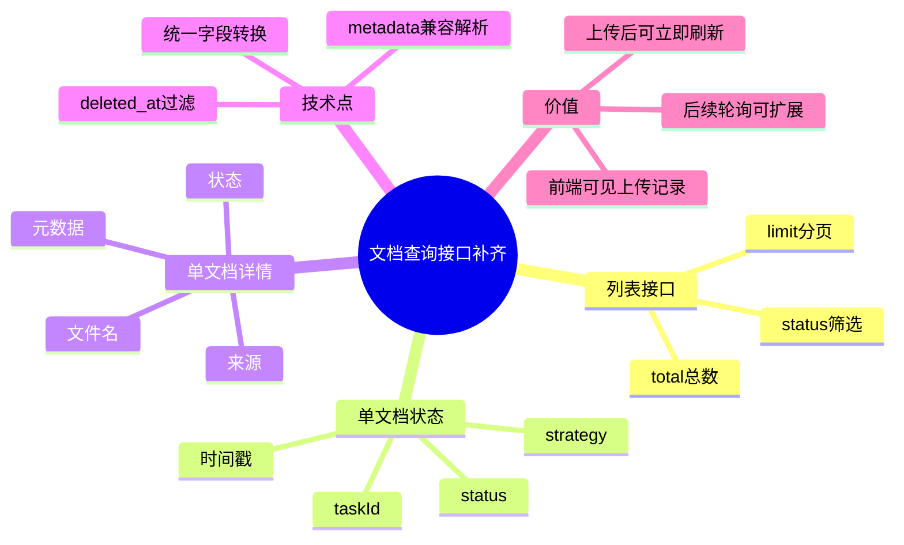

# 2026-03-01 文档列表与状态查询接口（后端）

主公，这一版后端把“上传了但前端看不到”的关键缺口补上了：

- `GET /api/v1/documents`：查最近上传文档列表
- `GET /api/v1/documents/{document_id}/status`：查单个文档状态
- `GET /api/v1/documents/{document_id}`：查单个文档完整信息

## 1. 这次改了哪些文件

1. `python-service/app/api/v1/endpoints/documents.py`

## 2. 实现细节（大白话）

### 2.1 列表接口

- 新增 `list_documents`，支持参数：
  - `limit`：默认 50，最大 200
  - `status`：可选，按状态筛选（如 `queued` / `completed`）
- 查询时固定过滤 `deleted_at IS NULL`，避免把软删除数据查出来。
- 先跑 `COUNT(*)` 算总数，再查明细，返回：
  - `items`
  - `total`

### 2.2 单文档状态接口

- 新增 `get_document_status`。
- 通过 `id::text = $1` 查 UUID，避免参数格式不对导致 SQL 转换报错。
- 返回前端最关心的字段：`status`、`taskId`、`strategy`、时间戳。

### 2.3 单文档详情接口

- 新增 `get_document_detail`。
- 和状态接口共用同一套行数据转换函数，避免字段不一致。

### 2.4 元数据解析统一

- 新增 `_parse_metadata` 和 `_to_document_item`：
  - 兼容 `metadata` 可能是 dict 或字符串 JSON
  - 统一抽取 `taskId`、`strategy`、`fileSizeBytes`、`traceId`
  - 统一输出 `createdAt/updatedAt` ISO 时间

## 3. 为什么这样做

- 之前只有上传接口，没有查询接口，所以前端上传成功后无法拿到“历史上传列表”。
- 这次补齐后，前端可以做到：
  - 页面初始加载就看到历史文档
  - 上传成功后立即刷新列表
  - 后续可扩展轮询状态

## 4. 小赵思考

- 先把查询接口做成轻量、稳定的读接口，不和后续 Worker 逻辑耦合。
- 状态接口和详情接口都保留，前端可以按场景选最小数据量的接口。
- 先用 `status` 文本筛选满足 MVP，后续如果状态枚举固定再收紧校验规则。

## 5. 思维导图

