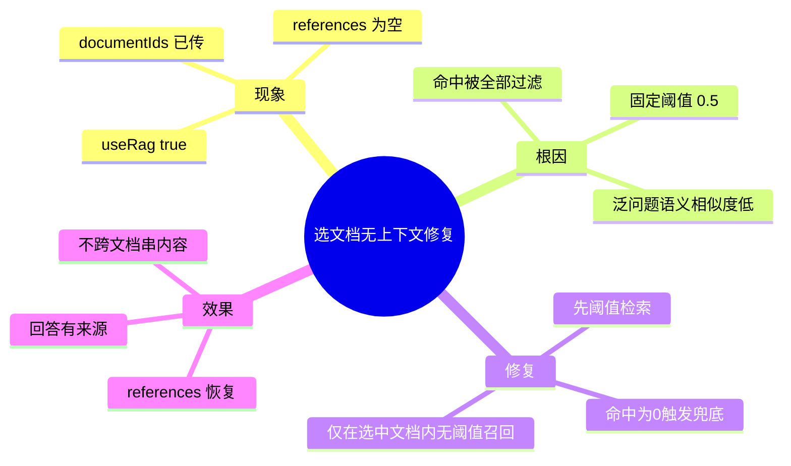

# 2026-03-01 文档已选但无上下文召回兜底

主公，这次修的是一个体验硬伤：明明选了文档，问“这个文档说了什么”，结果回答里没有上下文引用。

## 1. 问题现象

- 前端已经传了：
  - `useRag=true`
  - `documentIds=[...]`
- 但有些问题（比如“这个文档说了些什么？”）语义太泛，向量相似度低于阈值后会被全过滤。
- 结果是：
  - `references=[]`
  - 模型只能说“没有上下文”。

## 2. 根因（大白话）

- 后端检索时用了固定阈值 `rag_min_score=0.5`。
- 在“限定文档范围”的场景下，这个阈值过于刚性。
- 不是没选文档，而是“选了文档但阈值把结果都卡掉了”。

## 3. 这次改了什么

改动文件：`python-service/app/domain/vector_store.py`

- 当 `document_ids` 有值时，先走原来的阈值检索。
- 如果命中 0 条，自动兜底：
  - 仍然只在选中文档里检索；
  - 去掉阈值过滤，按向量距离取最相关 `top_k` 候选。
- 这样不会跨文档乱召回，同时能保证“选了文档就有上下文可用”。

补充改动文件：`python-service/app/api/v1/endpoints/chat.py`

- 聊天历史接口读取 `chat_messages."references"` 时，补了 JSON 解析兼容：
  - 兼容 asyncpg 返回 `str` / `list` 两种形态；
  - 避免把字符串误当数组做 `list(value)`，导致引用数量异常。
- 修复后，历史对话里的“引用来源”可以正确显示，不会出现空白或乱码长度。

## 4. 验证结果

- 用同一文档 ID 测试问题：`这个文档说了些什么？`
- 修复前：
  - `done.references = []`
- 修复后：
  - `done.references` 返回 5 条；
  - 回答会引用对应来源编号，不再空口回答。
- 历史接口复测：
  - `GET /api/v1/chat/sessions/{sessionId}/messages` 中 assistant 的 `references` 能正确返回对象数组。

## 5. 小赵思考

- “限定文档问泛问题”是高频真实场景，不能只靠单一阈值。
- 工程上要先保证可回答，再由重排和提示词兜精度。
- 这次兜底只在 `document_ids` 场景触发，风险范围可控。

## 6. 思维导图

