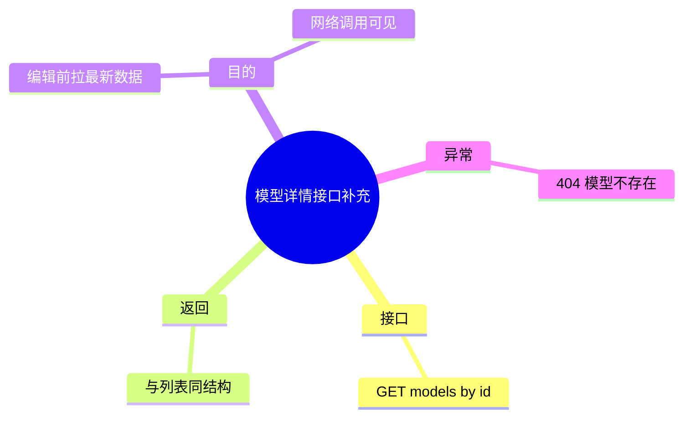

# 2026-03-01 模型详情接口补充（后端）

主公，这次后端补的是一个很实用的小接口：编辑模型前，前端可以单独拉取最新详情。

## 1. 新增了什么

- 新增接口：`GET /api/v1/models/{model_id}`
- 文件：`python-service/app/api/v1/endpoints/models.py`

返回字段和模型列表保持一致：

- `id`
- `name`
- `provider`
- `capabilities`
- `status`
- `maxTokens`
- `baseUrl`
- `apiKey`

## 2. 为什么要补

- 原来前端“编辑弹窗”只用列表行数据，不会发详情请求。
- 主公在网络面板看不到接口调用，也不确定是不是最新数据。
- 现在点编辑时可显式请求详情，链路更直观。

## 3. 异常处理

- 模型不存在时返回 `404`，错误信息：`模型不存在`。

## 4. 小赵思考

- 详情接口和列表接口字段保持一致，前端复用类型最简单。
- 后续若要做“编辑前权限校验/审计”，详情接口是天然挂载点。

## 5. 思维导图

