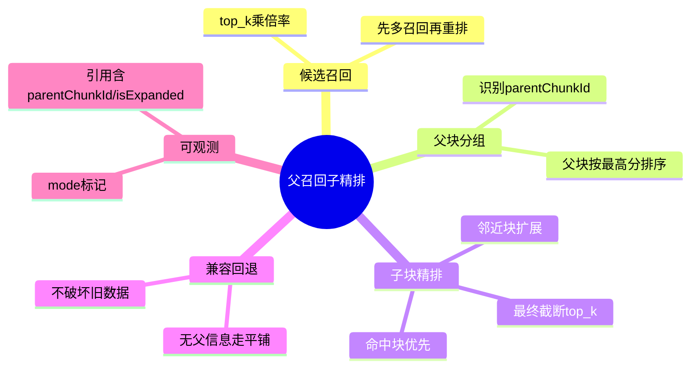

# 2026-03-01 父召回子精排检索落地（后端）

主公，这一版不是只改“切分预览”，而是把检索阶段也升级成父子思路了。

## 1. 这次改了哪些文件

1. `python-service/app/domain/vector_store.py`
2. `python-service/app/domain/rag_service.py`
3. `python-service/app/core/config.py`

## 2. 实现细节（大白话）

### 2.1 先扩大候选，再重排

- 以前是直接 `top_k` 命中几个 chunk 就返回。
- 现在先按 `candidate_multiplier` 拉更多候选（默认 6 倍），再做重排。

### 2.2 父召回子精排逻辑

- 如果 chunk metadata 里有父块标识（比如 `parentChunkId`），就会进入父子模式。
- 先按父块分组，用组内最高分作为父块分。
- 选出前几个父块后，再补同父块下邻近子块（左右窗口默认 1）。
- 最后按“父块优先、命中优先、分数优先”排序，截断到 `top_k`。

### 2.3 兼容策略

- 没有父块标识时，会自动退回原来的平铺检索，不会影响旧数据。
- 查询时补了 `documents.deleted_at IS NULL`，避免软删除文档被召回。

### 2.4 可配置参数

- `rag_parent_child_rerank`：是否启用父子重排（默认 `true`）
- `rag_parent_candidate_multiplier`：候选倍率（默认 `6`）
- `rag_parent_child_expand_window`：邻近子块扩展窗口（默认 `1`）

### 2.5 可观测性补齐

- `mcp.vector.search` 的日志输入摘要会标记检索模式（`mode=parent-child` 或 `mode=flat`）。
- 引用结果里新增：
  - `parentChunkId`
  - `isExpanded`（是否是邻近扩展出来的子块）

## 3. 小赵两轮思考

### 第一轮：先做“可回退”的真实升级

- 不能直接替换旧逻辑，否则历史数据没父块标识会退化。
- 所以先做“有父信息则重排，没有则平铺”的双轨策略。

### 第二轮：再做工程可控性

- 把倍率和窗口都放进配置，后续线上可调，不用每次改代码。
- 先用保守默认值，避免上下文膨胀太快。

## 4. 思维导图

