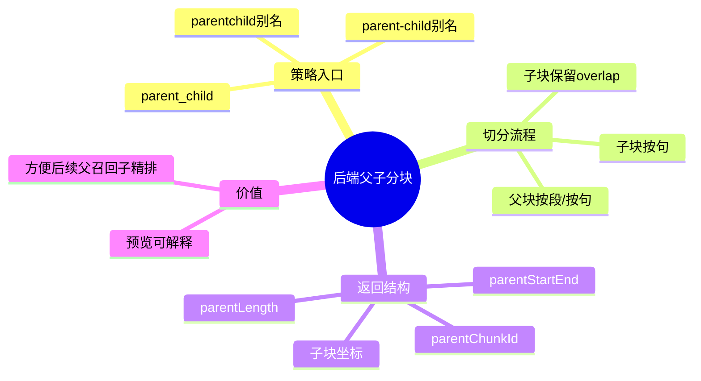

# 2026-03-01 父子文档切分策略接入（后端）

主公，这一版是在原有 `fixed/sentence/paragraph` 上，再补一档 `parent_child`（父子分块）。

## 1. 这次改了哪些文件

1. `python-service/app/api/v1/endpoints/documents.py`

## 2. 实现细节（大白话）

### 2.1 新增策略与别名

- 新增支持策略：`parent_child`
- 兼容别名：
  - `parent-child`
  - `parentchild`
- 所有别名都会归一成 `parent_child`，避免前后端命名不一致。

### 2.2 父子分块怎么切

- 父块大小：`parent_chunk_size = min(max(chunkSize * 3, chunkSize), 4000)`
- 父块优先按段落切（段落不够再按句切）。
- 子块在每个父块里继续按句切，再应用 `overlap`。
- 返回给前端的每个子块会额外带上父块信息：
  - `parentChunkId`
  - `parentStart`
  - `parentEnd`
  - `parentLength`

### 2.3 接口影响

- `POST /api/v1/documents/split-preview`：支持传 `strategy=parent_child`。
- `POST /api/v1/documents/upload`：支持上传时传 `strategy=parent_child`，并写入 metadata 与队列消息。

## 3. 小赵两轮思考

### 第一轮：先打通策略入口

- 先把策略枚举、别名归一化、参数校验补齐。
- 先确保“能选、能传、能落库、能回显”。

### 第二轮：再补父子关联信息

- 仅返回子块不够，检索调试看不出上下文归属。
- 所以在预览结构里附带父块字段，方便后续做父块召回与子块精排。

## 4. 思维导图

