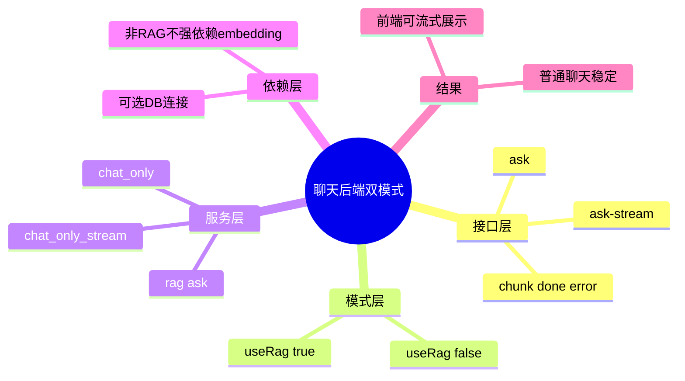

# 2026-03-01 聊天流式与非RAG模式

主公，这次后端把聊天接口拆成了两条路：

- 一条是 RAG（检索增强）；
- 一条是普通聊天（不走 embedding）。

并且补了 SSE 流式接口，前端可以边收边展示。

## 1. 这次改了什么

- `POST /api/v1/chat/ask` 增加 `useRag` 参数，默认 `false`。
- 新增 `POST /api/v1/chat/ask-stream`，返回 SSE 事件：
  - `chunk`
  - `done`
  - `error`
- 普通聊天模式不再强依赖 embedding/向量检索。
- 数据库依赖改为“可选连接”：非 RAG 场景下，DB 异常也不阻断普通问答。

## 2. 改动文件

- `python-service/app/api/v1/endpoints/chat.py`
- `python-service/app/domain/rag_service.py`
- `python-service/app/core/database.py`

## 3. 实现细节（大白话）

### 3.1 请求参数

- `useRag=false`：直接调用 `chat_only` / `chat_only_stream`。
- `useRag=true`：走原来的 embedding + 向量检索 + 生成链路。

### 3.2 为什么能解决“没选文档还报 embedding 失败”

- 以前聊天默认就是 RAG，没 embedding 配置就会炸。
- 现在普通聊天不进 embedding，天然绕开这个失败点。

### 3.3 流式事件规范

- `event: chunk` + `data: {"text":"..."}`：增量文本。
- `event: done`：返回 `sessionId/references/mode`。
- `event: error`：返回错误消息和 traceId。

## 4. 验证结果

已执行：

- `cd python-service && .venv/bin/python -m compileall app`
- 临时起服务后 `curl /api/v1/chat/ask`（`useRag=false`）验证普通聊天返回 200。
- 临时起服务后 `curl /api/v1/chat/ask-stream` 验证 SSE 事件流正常输出 `chunk/done`。

## 5. 小赵思考

- RAG 应该是“可插拔增强”，不是所有聊天都必须走的硬链路。
- 把普通聊天和 RAG 分清后，故障面会更小，排查也更直接。
- 先让用户拿到稳定聊天，再逐步打开检索增强，是更稳妥的工程策略。

## 6. 思维导图

