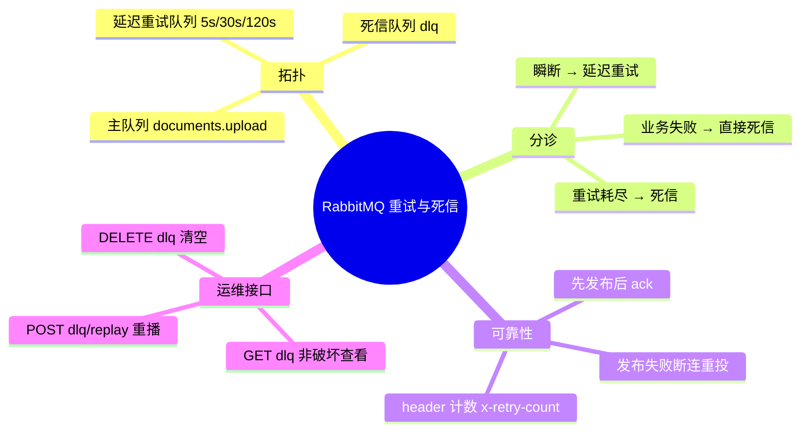

# 2026-09-16 RabbitMQ 重试与死信落地

主公，这次把文档处理链路的"失败即丢"改成"可重试、可兜底、可恢复"：瞬断自动延迟重试，业务性失败和重试耗尽进死信队列，死信可查看、可重播、可清空。

## 1. 这次解决了什么

- 旧版 `_on_message` 用 `message.process(requeue=False)`：任务一失败就 ack 丢弃，只留一条 failed 状态，消息本体无法恢复。
- 现在的分诊逻辑：
  - **可重试错误**（DB/Redis/RabbitMQ 闪断、embedding 网络/超时/限流/5xx）→ 按档位延迟重试，默认 `5s/30s/120s`，由 `DOCUMENT_WORKER_RETRY_DELAYS_SEC` 配置。
  - **不可重试错误**（文件缺失、类型不支持、解码失败、无可用 embedding 模型、openai 认证/配置/参数错误、payload 非法）→ 直接进死信队列。
  - **重试耗尽** → 进死信队列，headers 记录 `x-retry-count` 与 `x-dlq-reason=retry-exhausted`。
- 文档状态机新增 `retrying`：`queued → processing → retrying ⇄ processing → completed | failed`。

## 2. 队列拓扑

```
documents.upload                  主队列（消费）
documents.upload.retry.5s/30s/120s  分档延迟队列（x-message-ttl，到期死信回主队列）
documents.upload.dlq              死信队列（终态，等人工处置）
```

- 重试队列用 `x-dead-letter-exchange=""` + `x-dead-letter-routing-key=documents.upload`，TTL 到期经默认交换机回到主队列。
- 固定档位分队列而不是 per-message TTL：避免 TTL 消息只在队头过期的队头阻塞语义。

## 3. 可靠性模式：先发布后 ack

- worker 通道开启 `publisher_confirms=True`。
- 失败处置 = 先把消息发布到重试队列或 DLQ（broker 确认）→ 再 ack 原消息。
- 处置发布失败 → 主动断开连接，未 ack 的消息由 broker 重投，**任何路径都不丢消息**（崩溃方向是重复而非丢失）。
- 重试计数走自定义 header `x-retry-count`，不依赖 broker 的 x-death 语义。

## 4. 主要改动文件

- `python-service/app/core/config.py`：`document_worker_retry_delays_sec` 配置 + `documents_dlq_queue` / `documents_retry_queue()` 派生属性。
- `python-service/app/core/rabbitmq.py`：`declare_documents_topology()` 统一声明拓扑；`publish_json` 支持 headers；新增 `publish_raw` / `open_channel`。
- `python-service/app/workers/document_worker.py`：手动 ack、错误分类（`NonRetryableTaskError` / `_is_retryable_openai_error`）、重试与死信发布、`_mark_document_retrying` / `_mark_document_failed`；Redis 任务缓存降级为 best-effort（DB 是事实来源）。
- `python-service/app/api/v1/endpoints/documents.py`：三个新接口（见下）。
- `python-service/.env.example`：新配置说明。

## 5. 新接口

- `GET /api/v1/documents/dlq?limit=20`：非破坏性查看死信。实现为"按声明时的 message_count 取数 → 回发队尾 → ack"，避免 `get+nack(requeue)` 立即取回同一条的死循环。
- `POST /api/v1/documents/dlq/replay`：body `{"taskIds": []}`（空 = 全部）。重播消息回主队列且 `x-retry-count` 清零，并把关联文档状态重置为 `queued`（metadata 记录 `replayedFromDlq`）。
- `DELETE /api/v1/documents/dlq`：清空死信。

## 6. 验证结果（真实环境）

- 拓扑声明：主队列 + 3 档重试 + DLQ 全部就绪。
- 业务失败（storagePath 不存在）：0 次重试直达 DLQ，`reason=non-retryable`，文档 failed。
- 瞬断类失败（无 Azure 凭证上传真实文件）：按 1s/2s/4s（测试档位）重试 3 次 → DLQ，`reason=retry-exhausted, retryCount=3`，全程无消息丢失。
- 配置类失败（openai Missing credentials）：修正分类后 0 次重试直达 DLQ（不再浪费 3 次重试 × tenacity 内部退避）。
- 重播：DLQ → 主队列，文档 `queued → processing → failed` 再入 DLQ，闭环完整。
- 编译：`python3 -m compileall app` 通过。

## 7. 踩过的坑

- `channel.get_queue()` 是协程，漏 await 导致 worker 启动循环崩溃。
- aio-pika `queue.purge()` 返回 `PurgeOk` 对象而非 int。
- `get + nack(requeue=True)` 做非破坏浏览会立即取回同一条消息（1 条被读成 10 条），必须按队列深度限定循环。

## 8. 思维导图


