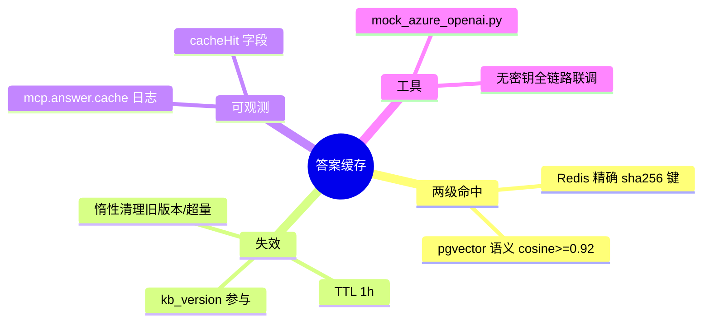

# 2026-09-16 Redis 答案缓存与语义命中落地

主公，这次给问答链路补上缓存层：热点问题秒回，相似问题也免重算，知识库一变更旧缓存自动失效。

## 1. 这次解决了什么

- `rag_service.ask` 原先没有任何缓存：同一个问题问两遍，两遍都完整走 embedding → 向量检索 → LLM 生成。
- 现在是三级流程：
  - **精确命中（Redis）**：`sha256(问题+模型+embedding模型+文档范围+检索参数+kb版本)` 直接取答案，跳过全部下游调用。
  - **语义命中（pgvector）**：精确未命中但已完成问题 embedding 后，在 `answer_cache` 表做 cosine 近邻检索，相似度 ≥ 阈值（默认 0.92）即复用答案。
  - **未命中**：正常检索生成后写回两级缓存。
- **失效机制**：上传/删除/工具导入文档时 `INCR kb:version`，版本号参与缓存键与语义查询条件，旧缓存自然失联；Redis 侧靠 TTL（默认 1h）回收，pg 侧在写入时顺手清理旧版本行并按 `updated_at` 淘汰超量行（默认上限 5000）。
- **可观测**：命中路径记 `mcp.answer.cache` skill 日志（kind/answer_chars），`/ask` 响应与流式 `done` 事件新增 `cacheHit/cacheKind/cacheSimilarity`。

## 2. 主要改动文件

- `python-service/app/domain/answer_cache.py`（新增）：`AnswerCacheService`，精确/语义查询、存储、kb 版本管理、惰性清理。所有操作 best-effort，缓存故障只降级性能不打断主链路。
- `python-service/app/core/database.py`：`answer_cache` 表（cache_key 唯一、question_embedding VECTOR + hnsw cosine 索引、hit_count 统计）。
- `python-service/app/core/config.py`：`RAG_ANSWER_CACHE_ENABLED/TTL_SEC`、`RAG_SEMANTIC_CACHE_ENABLED/THRESHOLD`、`RAG_ANSWER_CACHE_MAX_ENTRIES`。
- `python-service/app/core/redis_client.py`：`get_int` / `incr_int`。
- `python-service/app/domain/rag_service.py`：ask 接入三级流程；`RAGResponse` 增加 `cache_hit/cache_kind/cache_similarity`。
- `python-service/app/api/v1/endpoints/chat.py`：响应与 done 事件透出缓存字段。
- `python-service/app/api/v1/endpoints/documents.py`：上传/删除/导入三处 bump kb 版本。
- `python-service/scripts/mock_azure_openai.py`（新增）：本地 mock Azure OpenAI（确定性词袋 embedding + 固定回答 + SSE 流式 + 可注入延迟），无真实密钥也能全链路联调。

## 3. 关键设计决策

- **先发布精确命中再做 embedding**：精确命中的场景连 embedding 调用都省掉，延迟最低。
- **语义命中放在 embedding 之后**：复用问答流程本来就要算的查询向量，一次近邻检索（毫秒级）换掉检索+生成（秒级）。
- **语义命中只在"全部文档"作用域生效**：带 `documentIds` 过滤时不同作用域答案不可互换，只做精确命中（文档范围参与哈希）。
- **kb 版本失效是粗粒度的**：任何文档变更让全库缓存失联，简单可靠；细粒度按文档失效等有真实压测数据后再做。
- **mock 服务入库 scripts/**：后续无密钥开发/回归测试可复用，`MOCK_LLM_DELAY_MS` 环境变量可模拟慢模型。

## 4. 验证结果（mock 全链路）

- 模型 baseUrl 指向本地 mock 后：上传文档入库 → 提问未命中（带真实引用）→ 同题重问精确命中（sim=1.0）→ 同字符改述语义命中（sim=0.957）→ 无关问题不误命中。
- 上传新文档后 kb_version=2，旧缓存未命中，重新生成后再次精确命中；pg 旧行被顺手清理，`hit_count` 正确累计。
- 流式模式 done 事件带 `cacheHit`；`mcp_skill_logs` 有 `mcp.answer.cache` 记录。
- 延迟对比（mock 注入 800ms LLM 延迟）：未命中 834ms vs 精确命中 4ms，约 200 倍。
- 编译 `python3 -m compileall app` 通过。

## 5. 思维导图

