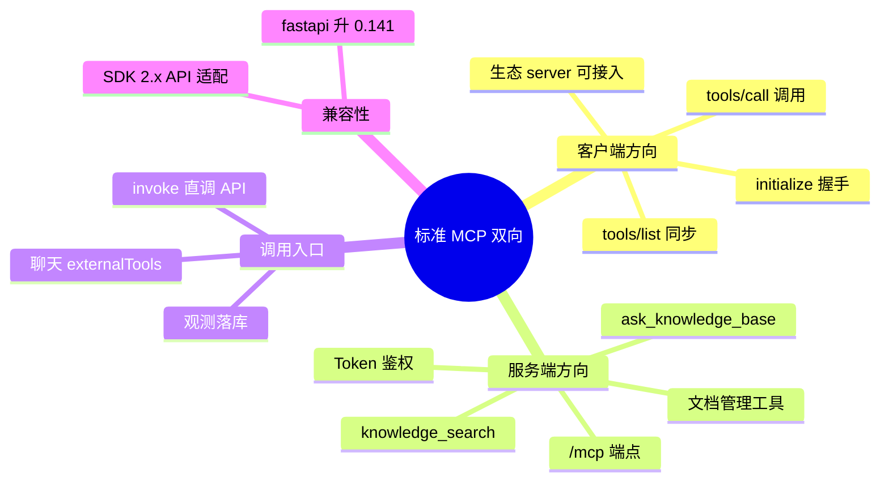

# 2026-09-17 MCP 双向能力落地（标准协议）

主公，这次把 MCP 从"自定义协议空壳"升级为**标准 MCP 协议的双向能力**：既能接入外部 MCP 生态，也能把知识库暴露给任何 MCP 客户端。

## 1. 这次解决了什么

- 旧外部轨用自定义 HTTP 协议（`{"op":"list_tools"}`），MCP 生态的服务器一个都接不了，且外部工具同步后没有任何调用入口。
- 现在两个方向都是标准 MCP（JSON-RPC over Streamable HTTP，官方 Python SDK `mcp` 2.x）：

**作为客户端（接入外部 MCP Server）**
- `standard_client.py`：`initialize` 握手 → `tools/list` → `tools/call`，每次调用独立会话。
- gateway 外部轨完全替换为标准协议；`mcp_servers` 的 bearer/apikey 鉴权映射为 HTTP 头。
- 同步工具拿标准 `inputSchema` 入库；生态服务器（GitHub、Filesystem 等）可直接注册同步。

**作为服务端（对外暴露知识库）**
- `/mcp` 端点暴露 4 个标准 MCP 工具：`knowledge_search`（向量检索）、`ask_knowledge_base`（完整 RAG 问答，享答案缓存）、`list_documents`、`upload_text_document`（入库走处理队列+版本失效）。
- Claude Desktop、Cursor 等任何标准 MCP 客户端配置 `http://<host>:8090/mcp` 即可使用知识库。
- 可选 Bearer Token 鉴权（`MCP_SERVER_TOKEN`，空则放行，仅限内网）。

**调用入口补齐**
- `POST /api/v1/mcp/tools/{name}/invoke`：直调任意注册工具（内置/外部），带观测落库。
- 聊天请求新增 `externalTools: [工具名]`：回答前显式调用指定 MCP 工具，输出作为证据注入上下文。

## 2. 主要改动文件

- `python-service/app/domain/mcp/standard_client.py`（新增）：标准 MCP 客户端。
- `python-service/app/domain/mcp/server_expose.py`（新增）：MCP 服务端（4 工具 + 会话管理生命周期）。
- `python-service/app/domain/mcp/gateway.py`：外部轨换标准协议（删除自定义协议代码）。
- `python-service/app/domain/tools/orchestrator.py`：`external_tools` 显式工具调用与 `[MCP 工具输出]` 证据注入。
- `python-service/app/api/v1/endpoints/mcp.py`：invoke 直调接口。
- `python-service/app/api/v1/endpoints/chat.py`：`AskRequest.externalTools`。
- `python-service/app/main.py`：`/mcp` 挂载 + 会话管理器手动驱动 + Token 中间件；**fastapi 升级 0.116.1 → 0.141.1**（mcp 依赖的 starlette 1.6 与旧版不兼容）。

## 3. 踩过的坑

- mcp 2.x 把 starlette 升到 1.6，旧 fastapi 0.116.1 还在传已删除的 `on_startup` 参数 → 升 fastapi。
- SDK 2.x `streamable_http_client` 返回 2 元组（旧版 3 元组），解包报 TaskGroup 嵌套错误，真实原因被吞。
- Starlette 的 Mount 不会驱动子应用 lifespan → MCP 会话管理器需在主 lifespan 手动 `session_manager.run()`。
- SDK 2.x `FastMCP` 已改名 `MCPServer`（`from mcp.server.mcpserver import MCPServer`）。

## 4. 验证结果（dogfood：自己连自己）

- 把自身 `/mcp` 注册为外部 server（serverKey=rag-self）→ 标准协议同步出 4 个工具。
- `POST /mcp/tools/knowledge_search/invoke`（query 命中语料）→ 返回真实检索结果（mcp-kb.txt, score 0.766, 30ms）。
- `ask_knowledge_base` 经 MCP 协议走完整 RAG 链路成功。
- 聊天 `externalTools:["knowledge_search"]` → toolRuns 记录 `('knowledge_search','external','success')`，工具输出注入回答上下文。
- compileall 通过；后端健康。

## 5. 思维导图

