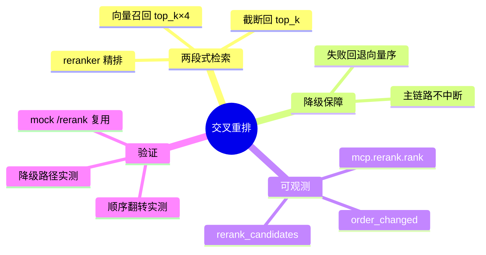

# 2026-09-17 交叉重排落地（阶段 C 收官）

主公，这次把注册表里闲置的 bge-reranker-v2-m3 真正用起来：检索从"向量余弦一锤定音"升级为"向量召回 + 交叉精排"两段式。

## 1. 这次解决了什么

- 之前所谓 rerank 只有父召回子扩展（结构聚合），没有真正的相关性重排；向量召回的排序对语义近义但表述不同的 query 经常不准。
- 现在的检索流程（rerank 模型在线且配置 baseUrl 时自动启用）：
  1. **候选召回**：`top_k × RAG_RERANK_CANDIDATE_MULTIPLIER`（默认 ×4，上限 50）个向量候选。
  2. **交叉重排**：候选正文 + 查询送 reranker 精排（Cohere/Jina 风格 `/rerank` HTTP 接口，TEI/vLLM 部署形态均兼容）。
  3. **截断回 top_k**：重排结果不足时用剩余候选按向量序补齐。
- **失败降级**：reranker 不可达/超时/响应异常 → 保持向量序截断，检索主链路绝不中断，skill 日志记录降级原因。
- **可观测**：`mcp.rerank.rank` 技能日志记录候选数、模型、最终条数、**order_changed**（顺序是否被重排改变）、top1 分数。

## 2. 主要改动文件

- `python-service/app/domain/reranker.py`（新增）：RerankerService（模型解析 + /rerank 调用 + 结果解析）。
- `python-service/app/domain/rag_service.py`：ask 接入两段式检索；vector.search 日志补 `rerank_candidates` 摘要。
- `python-service/app/core/config.py` + `.env.example`：`RAG_CROSS_RERANK_ENABLED / RAG_RERANK_CANDIDATE_MULTIPLIER / RAG_RERANK_TIMEOUT_SEC`。
- `python-service/scripts/mock_azure_openai.py`：新增 `/rerank` 端点（确定性词重叠打分），无真实 reranker 也能全链路验证。

## 3. 设计决策

- **重排只改顺序不改 score**：引用里的 score 保持向量分（含义稳定），重排分数记入 skill 日志。
- **两段式做在 rag_service 层**：vector_store 保持通用检索语义，重排是编排策略。
- **模型解析要求 baseUrl 非空**：注册表里有 rerank 能力但没部署端点的模型不启用，避免误降级。
- **降级而非失败**：重排是增益不是依赖，任何异常都退回向量序。

## 4. 验证结果（mock 全链路）

- 构造"向量序与词重叠序相反"的两文档语料：重排后 `order_changed=True`，词重叠高的文档升到首位（top1=0.7857），引用顺序覆盖向量序。
- reranker 指向不可达地址：skill 日志 `failed` + "重排失败已降级向量序"，回答正常返回且保持向量序。
- `mcp.vector.search` 日志可见 `rerank_candidates=20`，候选扩大生效。
- compileall 通过。

## 5. 思维导图

