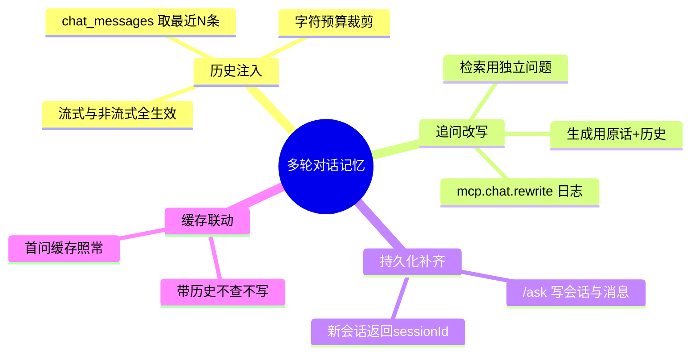

# 2026-09-17 多轮对话记忆落地

主公，这次把聊天从"金鱼记忆"升级成能听懂追问的多轮对话：同一会话里的指代性问题终于有解了。

## 1. 这次解决了什么

- 之前三处 LLM 调用（RAG 生成/普通对话/流式）的 messages 只有 `[system, user(本次问题)]`，模型完全不知道上文，"第二点展开讲讲"这类追问必挂。
- 非流式 `/ask` 只写观测日志、不写 `chat_messages`，历史根本积累不起来（流式路径倒是会存）。
- 现在的完整机制：
  - **历史加载**：带 `sessionId` 的请求从 `chat_messages` 取最近 N 条（默认 10，`CHAT_HISTORY_MAX_MESSAGES`），按字符预算（默认 8000，`CHAT_HISTORY_MAX_CHARS`）从头裁剪。
  - **历史注入**：生成消息变为 `[system, *history, user(本次问题)]`，RAG 与普通对话、流式与非流式全部生效。
  - **追问改写**：RAG 模式带历史时，先把追问用对话模型改写成独立问题（展开指代）再做 embedding 与检索；改写失败自动退回原问题。生成仍用用户原话 + 历史，忠实于原始意图。
  - **非流式补齐**：`/ask` 成功后写 `chat_sessions` + 双条 `chat_messages`（与流式对齐），新会话生成 `session-{uuid}` 并在响应返回。
  - **缓存联动**：带历史的提问不查也不写答案缓存（同问句在不同上文里答案不同）；无历史首问照常缓存。回归验证通过。

## 2. 主要改动文件

- `python-service/app/domain/rag_service.py`：`_trim_history`、`QUESTION_REWRITE_SYSTEM_PROMPT`、`_rewrite_question`（记 `mcp.chat.rewrite` skill 日志）、`ask/chat_only/chat_only_stream` 增加 `history` 参数、缓存跳过条件。
- `python-service/app/api/v1/endpoints/chat.py`：`_load_chat_history` helper（失败降级空历史）；`/ask` 会话化 + 消息持久化；流式 RAG 与 chat-only 分支加载并传递历史。
- `python-service/app/core/config.py` + `.env.example`：三个新配置。
- `python-service/scripts/mock_azure_openai.py`：聊天接口回显"已带入N条历史｜近user:xxx｜近assistant:xxx"，system prompt 含"改写"时透传原问题——让记忆链路在无真实密钥时也可观测验证。

## 3. 设计决策

- **改写只用于检索，不用于生成**：改写可能漂移，生成用原话+历史最忠实；检索用独立问题才搜得到东西。
- **改写复用对话模型、temperature=0**：确定性优先，且不用额外部署。
- **缓存跳过而非缓存键加历史哈希**：v1 从简，带历史本来就不是热点重复问题；后续若要缓存可对"改写后的独立问题"做键。
- **历史裁剪从最旧开始丢**：保最近的上下文，符合对话注意力分布。
- **首条消息不查历史**：新会话（无 sessionId）直接跳过历史查询，省一次 DB 往返。

## 4. 验证结果（mock 全链路）

- 非流式追问：第 2 轮"已带入2条历史"、第 3 轮"已带入4条历史"，历史正确递增；消息表 6 条，持久化对齐流式。
- 流式 chat-only：追问回答带历史摘要，记忆送达模型。
- RAG 追问：cacheHit=false（正确跳过），`mcp_skill_logs` 出现 `mcp.chat.rewrite` success 记录。
- 缓存回归：无会话同题两问，第二次 exact hit 不受影响。
- 浏览器实测：连续两问，第二条回答带出上一轮内容。
- `python3 -m compileall app scripts` 通过。

## 5. 思维导图

