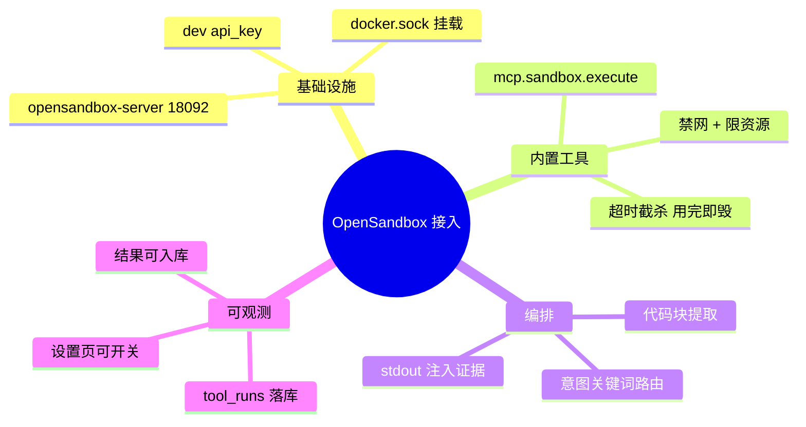

# 2026-09-17 接入阿里 OpenSandbox 代码沙盒

主公，这次把阿里开源的 OpenSandbox 接进插件体系：AI 可以在隔离沙盒里安全执行 Python 代码，计算类问题有了真执行能力。

## 1. 这次解决了什么

- 之前插件只有网页抓取一种真执行工具，"帮我运行这段代码"“算一下 2 的 100 次方”这类需求无从下手。
- 现在新增内置工具 **`mcp.sandbox.execute`**：
  - 问题里带 ```python 代码块 → 自动提取并在沙盒执行，stdout 作为证据注入回答上下文（与网页插件同模式）。
  - 沙盒环境：`python:3.11-slim`、1 CPU / 512Mi、**出口网络默认全禁**（defaultAction=deny）、单命令 `timeout` 截杀 + 沙盒整体生命周期超时双保险、用完即毁。
  - 返回结构化结果：exitCode / stdout / stderr（超长截断）/ 异常 traceback / timedOut。
- 意图路由：检测到代码块或"运行代码/执行代码/算一下"等意图即尝试；没有代码块时不盲目执行，skill 日志提示用户用代码块提供代码。

## 2. 基础设施与接入方式

- `docker-compose.yml` 新增 `opensandbox-server` 服务：官方 `opensandbox/server:latest` 镜像，宿主端口 **18092**（容器 8090），挂载 docker.sock 以 Docker 运行时创建沙盒容器；配置含 dev api_key、execd/egress 走阿里云镜像源、drop capabilities、pids_limit。
- Python SDK（`pip install opensandbox`）走 `ConnectionConfig(use_server_proxy=True)`：沙盒端点请求经 server 代理，避免容器/宿主网络可达性问题。
- 接入完全沿用项目 MCP 双轨插件体系：`registry.py` 注册 builtin 工具（设置页 MCP 工具列表自动出现、可开关）→ `gateway.py` 分发 → `orchestrator.py` 意图路由与证据注入 → tool_runs/mcp_skill_logs 可观测 → 工具结果可一键入库（复用 import-from-tool-run）。

## 3. 主要改动文件

- `docker-compose.yml`：opensandbox-server 服务 + TOML 配置。
- `python-service/app/domain/tools/builtin_sandbox.py`（新增）：`execute_python_code`，SDK 延迟导入（未部署沙盒不影响其余功能）。
- `python-service/app/domain/mcp/registry.py`：注册 `mcp.sandbox.execute`。
- `python-service/app/domain/mcp/gateway.py`：内置工具分发重构为 if/elif，沙盒 exitCode 非 0 记 failed。
- `python-service/app/domain/tools/orchestrator.py`：代码块提取 + 意图路由 + `[代码沙盒执行结果]` 证据注入。
- `python-service/app/core/config.py` + `.env.example` + `requirements.txt`：SANDBOX_* / OPEN_SANDBOX_* 配置与依赖。

## 4. 验证结果（真实沙盒）

- SDK 冒烟：`Sandbox.create` → `python3 -c 'print(2+3)'` → stdout `['5']` → destroy。
- 工具级：`2**100` 精确计算（1267650600228229401496703205376）；urllib 访问外网被网络策略拒绝（Traceback）；`sleep(60)` 5 秒超时被杀（exit 124, timedOut=true）。
- 编排级：带代码块问答 → toolRuns `mcp.sandbox.execute success 3966ms`，stdout（1加到100 = 5050 / 平方和 = 385）注入 rewritten_question 并落 tool_runs 观测表。
- 无代码块意图命中：不产生假执行，skill 日志提示补代码块。
- `python3 -m compileall app` 通过。

## 5. 已知边界与下一步

- 意图命中但无代码块时不会自动生成代码执行（当前编排是确定性路由）；下一步可让对话模型先写代码再送沙盒，形成完整的代码解释器闭环。
- 沙盒每次冷启动（~4s）；可用 SDK 的 SandboxPool 预热池优化延迟。
- 沙盒端口段 40000-60000 由 server 在宿主发布；`use_server_proxy=True` 下客户端不直连沙盒。

## 6. 思维导图


