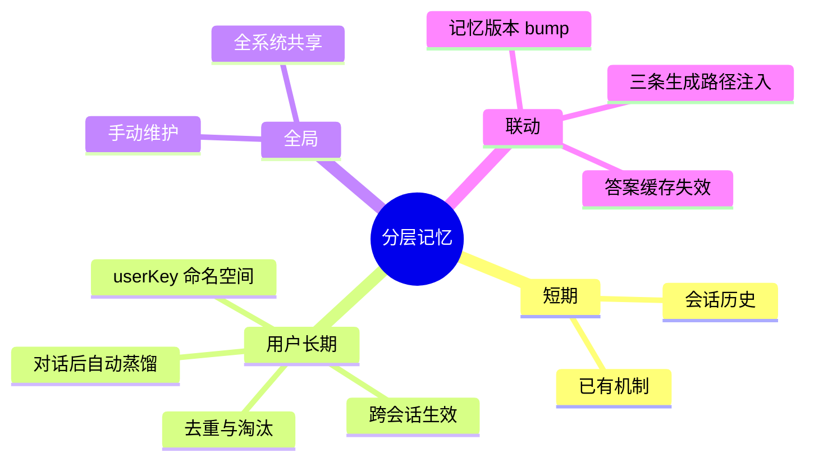

# 2026-09-20 分层记忆落地（短期/长期/全局）

主公，这次把记忆从"会话内多轮"升级为三层体系：模型终于有跨会话的"记性"了。

## 1. 三层记忆模型

| 层 | 载体 | 生命周期 | 维护方式 |
|---|---|---|---|
| 短期记忆 | `chat_messages`（会话历史注入） | 单会话 | 自动 |
| 用户长期记忆 | `memory_entries`（scope=user） | 跨会话持久 | **对话后自动蒸馏** + 手动增删 |
| 全局记忆 | `memory_entries`（scope=global） | 全系统共享 | 手动维护 |

注入格式（拼在 system prompt 尾部，三条生成路径全生效）：

```
[全局记忆]
- 回答统一使用简洁中文
[用户长期记忆]
- 用户叫小明，是数据平台的工程师
```

## 2. 关键机制

- **自动蒸馏**：每次回答成功后异步（fire-and-forget）用对话模型从"问+答"提取值得长期记住的事实（JSON 数组、每条≤60字、最多5条），写入用户长期记忆；重复内容去重（同 scope 同内容直接复用旧条目）。
- **缓存联动**：记忆变更（新增/修改/删除）bump redis `memory:version`，答案缓存键包含该版本——新记忆立即生效、旧缓存自然失效；蒸馏去重命中不 bump，避免无谓失效。
- **超量淘汰**：单 scope 超过 200 条时按重要度+时间淘汰。
- **注入上限**：上下文最多注入 20 条（按重要度/更新时间排序）。
- **开关齐全**：`LAYERED_MEMORY_ENABLED`（总开关）、`MEMORY_DISTILL_ENABLED`（蒸馏）等全部可配。

## 3. API 与前端

- `GET/POST /api/v1/memory`、`PATCH/DELETE /api/v1/memory/{id}`（BFF 路由同步补齐）。
- 聊天请求新增 `userKey`（用户长期记忆命名空间，默认 default）。
- 设置页新增"分层记忆管理"面板：范围选择（全局/用户）+ 内容 + 重要度添加；表格展示范围/来源（手动/自动蒸馏）/重要度/启停开关/删除。
- mock 新增蒸馏模式（从问答回显确定性"事实"）与注入回显标记 `（记忆注入：全局N块/用户M块）`，无密钥可验证全链路。

## 4. 主要改动文件

- `python-service/app/domain/memory.py`（新增）：MemoryService（加载/增删改/去重/淘汰/蒸馏/版本）。
- `python-service/app/domain/rag_service.py`：`generate_text` 通用生成；三条路径注入 `memory_block`；缓存键加 memory 版本。
- `python-service/app/api/v1/endpoints/chat.py`：加载记忆块、回答后调度蒸馏、`userKey`。
- `python-service/app/api/v1/endpoints/memory.py`（新增）+ router 注册。
- `python-service/app/core/database.py`：`memory_entries` 表。
- 前端：types/rag-api/settings 页面板 + BFF memory 路由。

## 5. 验证结果（mock 全链路）

- 注入：加全局记忆后回答带"全局1块/用户0块"，再加用户记忆变"全局1块/用户1块"。
- 蒸馏：对话后 distilled 条目自动入库（内容来自问答）；同题重复蒸馏去重（两次同问仅 +1 条）。
- 缓存联动：RAG 模式同题连问——首次蒸馏 bump 使旧缓存失效，第二次起语义缓存兜底命中（exact/semantic 均正常）。
- CRUD：手动增/启停/删全通；设置页面板渲染正常（范围/来源标签正确）。

## 6. 思维导图


