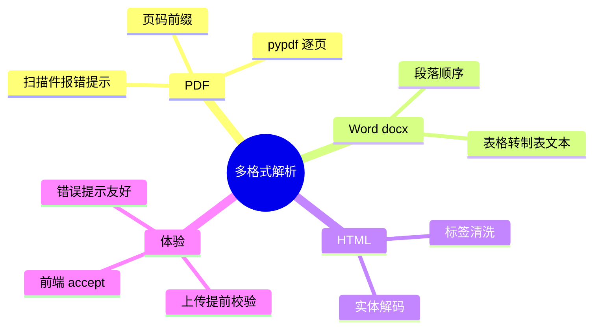

# 2026-09-20 多格式文档解析落地（PDF/Word/HTML）

主公，这次把知识库的"入口"补齐：PDF、Word(docx)、HTML 都能直接入库了，不再只认纯文本。

## 1. 这次解决了什么

- 之前 worker 只支持 txt/md/csv/json，前端上传提示却写着"支持 PDF、Word"——虚假宣传，传了必然失败进死信。
- 现在：
  - **PDF**（pypdf）：逐页提取文本，带 `[第N页]` 前缀（与 pageindex 切分策略天然配合）；扫描件/图片型 PDF 提取不到文本时明确报错提示先 OCR。
  - **Word .docx**（python-docx）：按段落顺序提取，表格逐行拼接为制表符分隔文本。
  - **HTML/.htm**：复用网页插件同款清洗（去 script/style/noscript/标签 + 实体解码），标题与正文保留。
  - 纯文本类不变（utf-8/utf-8-sig/gb18030 多编码）。
- **上传提前校验**：白名单外的后缀（如 .doc/.xlsx）在 upload 接口直接 400 友好提示，不再等 worker 失败进死信。
- 前端上传组件加 `accept` 限制与真实文案（含"扫描件 PDF 请先 OCR"提示）。

## 2. 主要改动文件

- `python-service/app/domain/document_extract.py`（新增）：统一入口 `extract_text`，`SUPPORTED_EXTRACT_EXTENSIONS` 白名单常量供 worker 与上传端点共用。
- `python-service/app/workers/document_worker.py`：`_read_text_file` 改为按扩展名分发。
- `python-service/app/api/v1/endpoints/documents.py`：上传端点白名单提前校验。
- `python-service/requirements.txt`：pypdf、python-docx（均为纯 Python 轻量依赖）。
- `frontend/.../documents/page.tsx`：accept + 提示文案。

## 3. 已知边界

- `.doc`（老格式）/`.xlsx`/`.pptx` 不支持，上传时明确拒绝；后续需要时加 libreoffice 转换或对应解析库。
- 扫描件 PDF 无 OCR（报错提示而非静默入库空文档）。
- PDF 内嵌图片、docx 复杂排版（文本框/页眉页脚）未特殊处理，主正文可提取。

## 4. 验证结果（真实文件）

- docx（macOS textutil 生成）：段落完整提取 ✓
- html：标题+正文提取，script/style 剔除 ✓
- pdf（cupsfilter 生成文本型 PDF）：按页提取带页码前缀 ✓
- `.doc` 上传：400 提前拒绝，提示支持范围 ✓
- 三格式入库 completed 后，通过 MCP `knowledge_search` 检索 HTML 文档内容命中（score 0.6274）✓
- compileall 通过。

## 5. 思维导图

