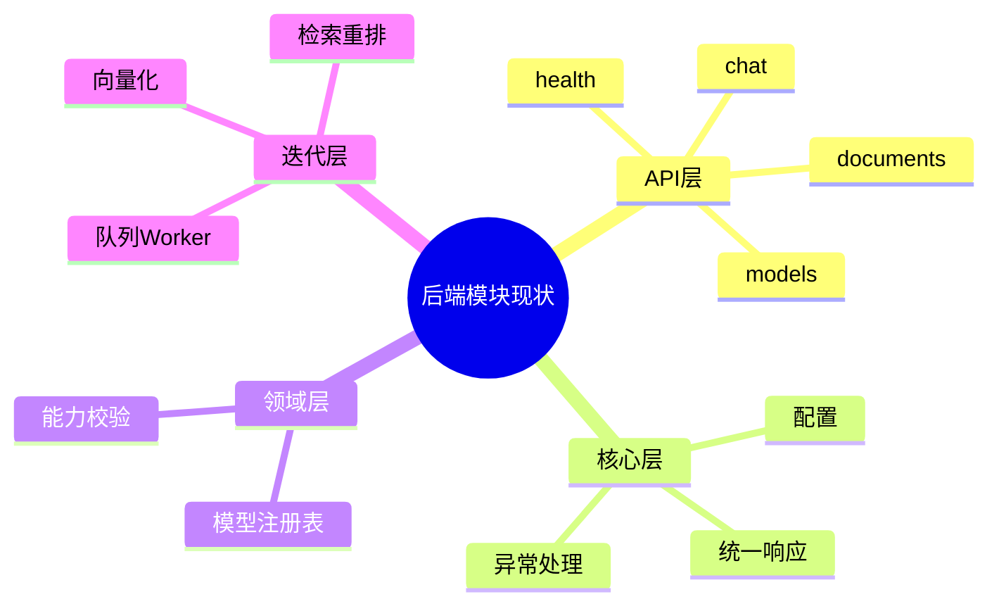

# 后端模块规划（Python FastAPI 为主）

主公，这里以后端真实落地结构为准，不走仓储层，保持简单清晰。

## 1. 当前目标

- Python 先提供最小可运行接口：健康、模型、聊天、文档上传、切割预览
- 响应统一 `code/message/data/traceId`
- 用命令/查询分离思路（CQRS）：写动作和读动作分开路径
- 后端默认运行端口：`8090`，默认允许前端 `8081` 跨域

## 2. 当前目录（已落地）

```text
python-service/
  app/
    api/v1/endpoints/
      health.py
      models.py
      chat.py
      documents.py
    core/
      config.py
      response.py
    domain/
      models_registry.py
    main.py
```

## 3. 已落地文档

- `docs/backend/python-fastapi-协作规范.md`
- `docs/backend/2026-02-28-python-service-初始版本.md`
- `docs/backend/2026-02-28-后端端口调整-8090.md`
- `docs/backend/2026-02-28-模型管理前后端联动-后端落地.md`
- `docs/backend/2026-02-28-python-service-接入pg-redis-rabbitmq.md`
- `docs/backend/2026-02-28-token可观测性-后端落地.md`
- `docs/backend/2026-03-01-observability-查询筛选增强.md`
- `docs/backend/2026-03-01-模型详情接口补充.md`
- `docs/backend/2026-03-01-文档列表与状态查询接口.md`
- `docs/backend/2026-03-01-聊天流式与非RAG模式.md`
- `docs/backend/2026-03-01-文档切分策略可选与上传提速.md`
- `docs/backend/2026-03-01-父子文档切分策略接入.md`
- `docs/backend/2026-03-01-pageindex切分策略接入.md`
- `docs/backend/2026-03-01-文档管理原文预览接入.md`
- `docs/backend/2026-03-01-父召回子精排检索落地.md`
- `docs/backend/2026-03-01-文档Worker父子元数据落库.md`
- `docs/backend/2026-03-01-ask-stream连接生命周期修复.md`
- `docs/backend/2026-03-01-文档已选但无上下文召回兜底.md`
- `docs/backend/2026-03-01-ask-stream消耗日志补齐.md`
- `docs/backend/2026-03-01-mcp双轨插件与深度思考落地.md`

## 4. 实现细节（大白话）

- 模型管理已升级为 JSON 持久化注册表，支持增删改查并在重启后保留（含 baseUrl/apiKey 配置）。
- Python 服务已在启动阶段接入 PostgreSQL、Redis、RabbitMQ，健康检查可返回三件中间件状态。
- 文档上传接口已接入中间件链路：入库 PostgreSQL + 写 Redis 任务态 + 投递 RabbitMQ 队列。
- 文档查询接口已补齐：支持文档列表、单文档详情、单文档状态查询。
- 聊天接口已接入真实 RAG 流程（embedding + 向量检索 + LLM 生成）。
- 聊天接口新增 SSE 流式输出；未开启 RAG 时可直接走普通对话，不强依赖 embedding。
- 聊天链路已经支持 token 与 MCP skill 调用日志入库，`/chat/ask` 和 `/chat/ask-stream` 都会写。
- `ask-stream` 在非 RAG 模式下会从流式最终 chunk 提取 usage，补齐 prompt/completion/total token。
- `ask-stream` 异常（HTTP 异常与运行时异常）也会尽量落失败日志，方便排查。
- 聊天链路已接入 MCP 双轨编排：内置工具 + 外部 MCP Server。
- 聊天接口新增 `enableTools/enableDeepThink/maxToolSteps`，支持对话级控制插件与深思。
- 新增 `tool_runs/deep_think_runs` 两张明细表，可按 trace 回放工具和阶段执行过程。
- 外部 MCP Server 支持 `sync-tools`，可把服务端工具清单同步到本地工具注册表。
- 文档新增“工具结果一键入库”接口，抓取结果可直接进知识库流水线。
- 文档上传先返回任务 ID，给后面接 RabbitMQ 留钩子。
- 切割预览先做纯文本切块，先让前端看得到结果。
- 文档切割策略已支持 `fixed/sentence/paragraph/parent_child`，并支持 `default -> fixed` 等别名兼容。
- 文档切割策略已扩展支持 `pageindex`，会按标题结构切分并写入 `nodePath/page` 等元数据。
- 文档接口已支持原文预览：`GET /api/v1/documents/{id}/file`，前端可直接内嵌查看上传源文件。
- RAG 检索阶段已支持“父召回子精排”：有父块信息走父子重排，没有则自动回退平铺检索。
- 文档上传后已由 Worker 真正消费并落 `document_chunks/chunk_embeddings`，父子 metadata 会随 chunk 入库。
- 上传入口算文件大小改为 `seek/tell`，避免整文件读入内存导致慢。

## 5. 当前思考

- 现在阶段先“链路通”，不急着引入复杂工程层。
- 不加仓储层，避免过度设计。
- 后续再补 Worker、向量化和检索重排。

## 6. 思维导图


