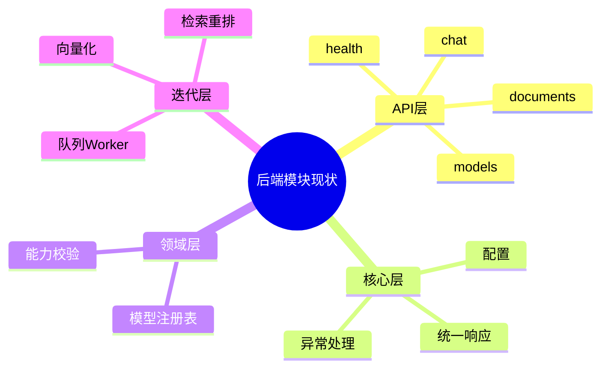

# 后端模块规划（Python FastAPI 为主）

主公，这里以后端真实落地结构为准，不走仓储层，保持简单清晰。

## 1. 当前目标

- Python 先提供最小可运行接口：健康、模型、聊天、文档上传、切割预览
- 响应统一 `code/message/data/traceId`
- 用命令/查询分离思路（CQRS）：写动作和读动作分开路径
- 后端默认运行端口：`8090`，默认允许前端 `8081` 跨域

## 2. 当前目录（已落地）

```text
python-service/
  app/
    api/v1/endpoints/
      health.py
      models.py
      chat.py
      documents.py
    core/
      config.py
      response.py
    domain/
      models_registry.py
    main.py
```

## 3. 已落地文档

- `docs/backend/python-fastapi-协作规范.md`
- `docs/backend/2026-02-28-python-service-初始版本.md`
- `docs/backend/2026-02-28-后端端口调整-8090.md`
- `docs/backend/2026-02-28-模型管理前后端联动-后端落地.md`

## 4. 实现细节（大白话）

- 模型管理已升级为 JSON 持久化注册表，支持增删改查并在重启后保留（含 baseUrl/apiKey 配置）。
- 聊天接口先做“模型能力校验 + 回显示例”，后续替换成真实检索生成。
- 文档上传先返回任务 ID，给后面接 RabbitMQ 留钩子。
- 切割预览先做纯文本切块，先让前端看得到结果。

## 5. 当前思考

- 现在阶段先“链路通”，不急着引入复杂工程层。
- 不加仓储层，避免过度设计。
- 后续再补 Worker、向量化和检索重排。

## 6. 思维导图


