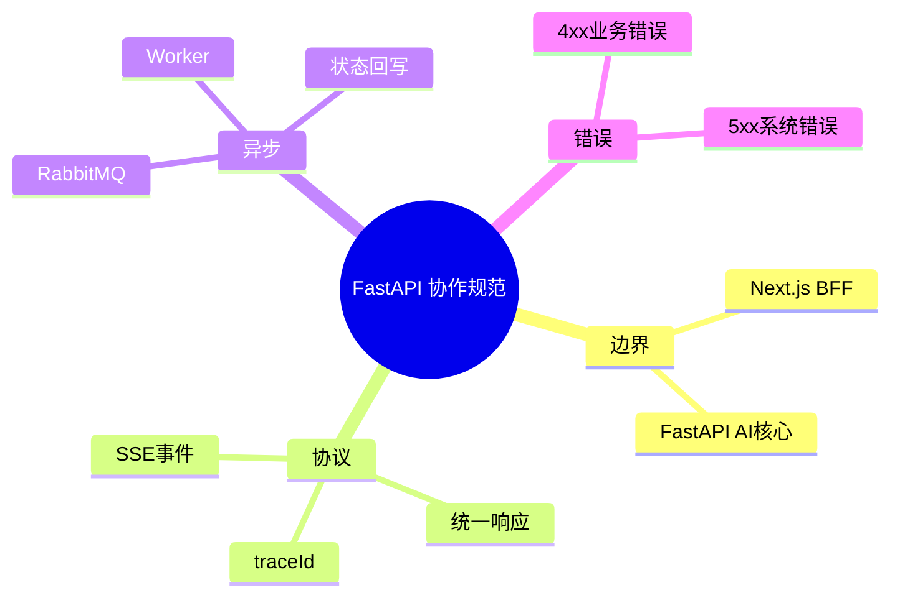

# Python FastAPI 协作规范（与 Next.js 配合）

## 1. 职责边界

- Next.js：页面、BFF、用户侧接口收口
- FastAPI：文档处理、向量检索、答案生成

## 2. 接口约定

- 所有请求带 `x-trace-id`
- 返回统一结构：`code/message/data/traceId`
- 流式返回用 SSE，事件名固定：`chunk/done/error`

## 3. 任务处理约定

- 上传后立即返回任务 ID
- 重任务投 RabbitMQ
- Worker 更新状态到 PostgreSQL
- 前端通过 SSE 或轮询拿进度

## 4. 错误处理

- 业务错误返回 4xx + 可读 message
- 系统错误返回 5xx + traceId
- 禁止把底层堆栈直接回给前端

## 5. 思维导图

