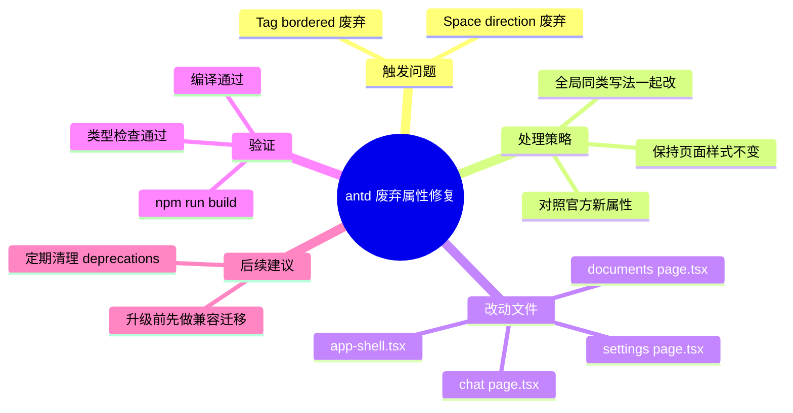

# 2026-02-28 antd 废弃属性告警修复

主公，这次主要是把 antd 升级后产生的控制台告警清掉，避免后续版本直接失效。

## 1. 这次改了什么

- 把 `Tag` 组件里的 `bordered={false}` 改成 `variant="filled"`。
- 把 `Space` 组件里的 `direction="vertical"` 改成 `orientation="vertical"`。
- 顺手把同类写法全局统一，避免只修一处、别的页面还继续报 warning。

## 2. 对应代码文件

- `frontend/src/components/app-shell.tsx`
- `frontend/src/app/(workspace)/documents/page.tsx`
- `frontend/src/app/(workspace)/chat/page.tsx`
- `frontend/src/app/(workspace)/settings/page.tsx`

## 3. 实现细节（大白话）

### 3.1 Tag 告警修复

- 旧写法：`<Tag bordered={false} />`
- 新写法：`<Tag variant="filled" />`
- 原因：antd 新版本把 `bordered` 标记为废弃，官方建议改 `variant`。

### 3.2 Space 告警修复

- 旧写法：`<Space direction="vertical" />`
- 新写法：`<Space orientation="vertical" />`
- 原因：antd 新版本把 `direction` 标记为废弃，建议迁移到 `orientation`。

## 4. 验证结果

已执行：

- `cd frontend && npm run build`

结果：

- Next.js 16.1.6 构建通过。
- TypeScript 检查通过。
- 本次涉及的 antd 废弃属性写法已替换完毕。

## 5. 小赵的思考

- 这种“还能跑但会报警”的问题要尽快处理，不然后面升级会变成真正报错。
- 这次不是只补点，而是把同类写法一次性统一，减少重复返工。
- 后续如果继续升级 antd，建议定期扫一遍控制台 deprecations 做提前迁移。

## 6. 思维导图

