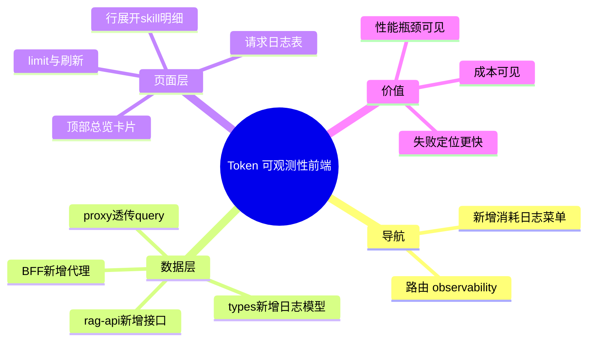

# 2026-02-28 Token 可观测性前端落地（消耗日志菜单）

主公，这次前端目标是把“看不到成本”的黑盒，变成能直接看的页面。

## 1. 这次做了什么

- 新增菜单
  - 文件：`frontend/src/components/app-shell.tsx`
  - 增加了 `消耗日志` 菜单，路径 `/observability`
  - 页面标题副标题也一起加上了
- 新增页面
  - 文件：`frontend/src/app/(workspace)/observability/page.tsx`
  - 展示每次问答的：
    - 问题
    - 模型
    - Prompt/Completion/Total Token
    - MCP 调用次数
    - 总耗时
    - 成功/失败状态
  - 支持展开行查看每个 Skill 明细
- 新增前端 API 封装
  - 文件：`frontend/src/lib/rag-api.ts`
  - 新增 `fetchConsumptionLogs(limit)`
- 新增类型定义
  - 文件：`frontend/src/types/rag.ts`
  - 新增 `ConsumptionLogItem`、`SkillCallLogItem`、`ConsumptionLogsResult`
- 新增 BFF 代理路由
  - 文件：`frontend/src/app/api/v1/observability/consumption-logs/route.ts`
  - 转发到 Python：`/api/v1/observability/consumption-logs`
- 增强代理工具
  - 文件：`frontend/src/app/api/_shared/proxy.ts`
  - GET 请求会透传 query 参数（比如 `limit=50`）

## 2. 页面交互设计（大白话）

- 顶部看总览：请求数、总 token、失败请求数。
- 下方看明细表：一行就是一次问答。
- 点开行看技能明细：每个 MCP skill 的 token、耗时、输入输出摘要、异常。
- 可调拉取条数（limit），并支持手动刷新。

## 3. 为什么这样做

- 以前只能看回答，不知道代价和瓶颈。
- 现在能快速回答三个问题：
  - 哪些问题最耗 token？
  - 哪个 skill 最慢？
  - 失败到底卡在哪一步？

## 4. 小赵的实现思考

- 先做“可看明细”，再谈图表和高级筛选。
- 明细用可展开表格，信息量大但不挤。
- API 统一走 BFF，后续做鉴权或脱敏改一处就够了。

## 5. 思维导图

