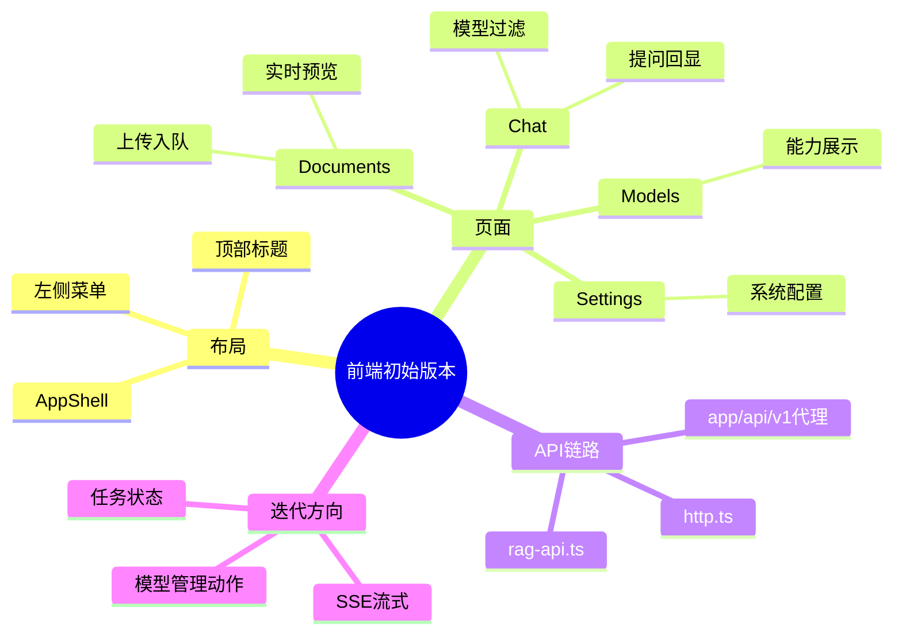

# 2026-02-28 前端初始版本落地记录

## 1. 本次做了什么

1. 引入 antd 与 `@ant-design/nextjs-registry`，解决 App Router 的样式注入问题。
2. 完成 4 个业务页面：`/chat`、`/documents`、`/models`、`/settings`。
3. 完成前端 API 代理链路：`/api/v1/*` -> Python FastAPI。
4. 完成聊天模型选择限制：仅可选支持 chat 的在线模型。
5. 完成文档切割“实时预览”基础版（防抖请求 + 手动预览）。

## 2. 关键实现细节

- 布局：`src/components/app-shell.tsx`
  - 左侧是主菜单，顶部是页面标题，内容区放各模块。
- 聊天：`src/app/(workspace)/chat/page.tsx`
  - 首次加载拉取模型列表，过滤出 chat 可用模型。
  - 提问调用 `/api/v1/chat/ask`，回显答案和引用。
- 文档：`src/app/(workspace)/documents/page.tsx`
  - 上传调用 `/api/v1/documents/upload`，拿任务 ID。
  - 切割预览调用 `/api/v1/documents/split-preview`。
- 模型：`src/app/(workspace)/models/page.tsx`
  - 表格展示模型能力和状态，给聊天页的可选范围做可视化依据。
- 设置：`src/app/(workspace)/settings/page.tsx`
  - 只保留系统设置入口，不混入模型管理。

## 3. 为什么这么做（思考）

- 先把页面角色分清，避免后面功能叠加后页面职责混乱。
- 先走 BFF 代理，后续改后端地址、加鉴权不用大规模改前端代码。
- 模型限制先在前端做第一层，后端再做最终兜底校验，双保险。

## 4. 下一步建议

- 聊天页接入流式 SSE 返回。
- 文档页接入任务状态轮询/SSE。
- 模型页增加增删改与启停状态变更。

## 5. 思维导图

