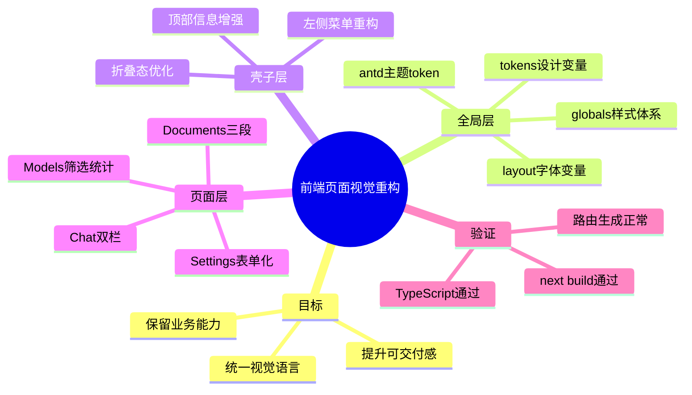

# 2026-02-28 前端页面视觉重构（frontend-design）

## 1. 本次改了什么

主公，这一轮不是改接口，而是把前端页面整体做了一次“可交付级”重构，目标是：

1. 保留现在所有业务能力（聊天提问、文档上传与切割预览、模型列表、系统设置表单）。
2. 统一视觉语言（颜色、字体、背景、动效、卡片结构）。
3. 让四个页面都更像同一个“指挥台系统”，而不是四个独立 Demo。

## 2. 视觉方向（大白话）

- 主题方向：**军机中枢 / 战情控制台**。
- 主色不走常见紫白风，改成“黛绿 + 金砂”的稳重方案。
- 字体改成“中文衬线标题 + 中文无衬线正文 + 等宽数字”，信息层次更明显。
- 页面做了统一的卡片、统计条、分区标题和微动效，滚动和切换不再突兀。

## 3. 具体落地文件

### 3.1 全局层

- `frontend/src/app/layout.tsx`
  - 引入 `Noto Serif SC` 作为标题字体变量。
  - 更新站点 metadata 文案。
- `frontend/src/components/app-providers.tsx`
  - 调整 antd 全局 token（主色、边角、组件视觉）。
- `frontend/src/styles/tokens.css`
  - 重建设计变量（背景、文本、边框、阴影、半径、动效曲线）。
- `frontend/src/app/globals.css`
  - 重写全局样式与页面样式体系（壳子、卡片、响应式、动效）。

### 3.2 壳子层

- `frontend/src/components/app-shell.tsx`
  - 左侧菜单视觉重构，支持折叠状态下更清晰展示。
  - 顶部 Header 增加副标题与系统状态标签。
  - 菜单名称统一改成战情语义（战情问答、卷宗中台、模型编组、系统军规）。

### 3.3 页面层

- `frontend/src/app/(workspace)/chat/page.tsx`
  - 重构为“模型与提问区 + 会话流区”的双栏结构。
  - 增加快捷问题模板、会话时间、引用标签风格统一。
  - 保留原有模型筛选与问答请求逻辑。
- `frontend/src/app/(workspace)/documents/page.tsx`
  - 重构为“上传入队 + 切割试算 + 结果面板”三段结构。
  - 增加文本长度/预测切片统计和任务号回显。
  - 保留自动预览与手动预览联动逻辑。
- `frontend/src/app/(workspace)/models/page.tsx`
  - 增加搜索 + 状态分段筛选。
  - 增加模型统计卡和在线行高亮。
  - 保留模型拉取与能力展示逻辑。
- `frontend/src/app/(workspace)/settings/page.tsx`
  - 从占位文案改成“可填写、可保存（前端演示）”的系统设置页。
  - 分成运行环境与安全策略两组配置，保留页面职责边界。

## 4. 业务边界和兼容性

- 没改后端接口契约，现有 `/api/v1/*` 代理链路不受影响。
- 聊天页仍然只允许选择 `chat + online` 模型。
- 文档页上传和切割预览接口仍走原来的 `rag-api.ts`。
- 这轮重点是“界面重构 + 交互重排”，不是“后端功能扩展”。

## 5. 验证结果

已执行：

- `cd frontend && npm run build`

结果：

- Next.js 构建通过。
- TypeScript 检查通过。
- 路由静态生成正常（`/chat`、`/documents`、`/models`、`/settings`）。

## 6. 小赵的思考

- UI 重构不能只换颜色，必须把结构、信息层级、状态反馈一起重排。
- 先统一壳子和设计变量，再改页面，后续加新模块才不会再次风格漂移。
- 这轮先把“看得顺、用得清”打稳，后面再接流式聊天和任务状态 SSE 会更自然。

## 7. 思维导图

