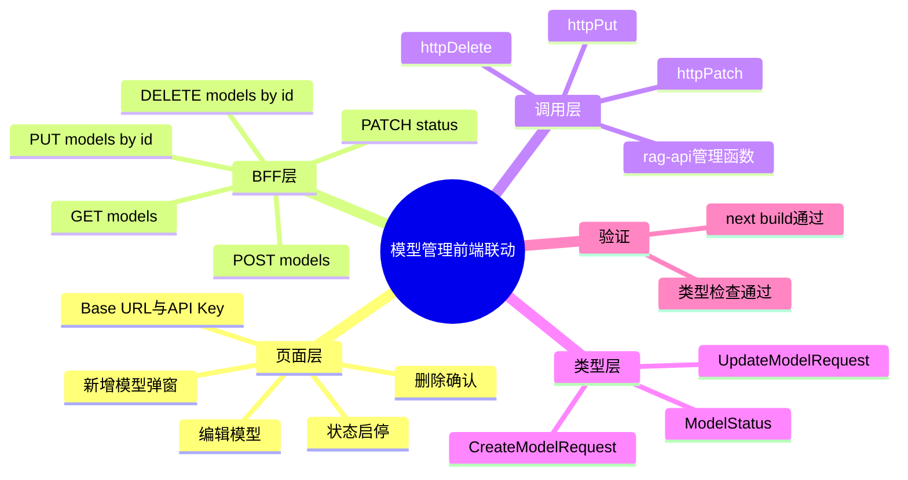

# 2026-02-28 模型管理前后端联动（前端落地）

主公，这一版把模型页从“只看列表”升级成“真管理”，不是静态展示了。

## 1. 这次前端改了什么

- 模型页接入真实管理动作：新增、编辑、启停、删除。
- 新增模型支持填写 `Base URL` 和 `API Key`，编辑时也可更新。
- 模型管理动作全部走 Next.js BFF，再转到 Python 服务。
- 模型页状态变更后会马上更新表格，聊天页拿到的可用模型也会跟着变。

## 2. 改了哪些前端文件

- `frontend/src/app/(workspace)/models/page.tsx`
- `frontend/src/lib/rag-api.ts`
- `frontend/src/lib/http.ts`
- `frontend/src/types/rag.ts`
- `frontend/src/app/api/v1/models/route.ts`
- `frontend/src/app/api/v1/models/[modelId]/route.ts`
- `frontend/src/app/api/v1/models/[modelId]/status/route.ts`
- `frontend/src/app/globals.css`

## 3. 关键实现细节（大白话）

### 3.1 模型页不再只是展示

- 增加“新增模型”弹窗，能填模型 ID、名称、提供商、能力、状态、最大 Token。
- 增加 `Base URL` 和 `API Key` 字段，便于后续接真实模型供应商。
- 每行加了操作区：状态开关、编辑、删除。
- 删除前有二次确认，避免误删。

### 3.2 BFF 路由补齐

- 之前只有 `GET /api/v1/models`。
- 现在补齐：
  - `POST /api/v1/models`
  - `PUT /api/v1/models/:modelId`
  - `PATCH /api/v1/models/:modelId/status`
  - `DELETE /api/v1/models/:modelId`
- BFF 代理层改成：只有 `POST/PUT/PATCH` 才透传 JSON Body，`DELETE` 不再带空 body，减少 501 异常概率。

### 3.3 前端调用层补齐

- `http.ts` 新增 `httpPut/httpPatch/httpDelete`。
- `rag-api.ts` 新增 `createModel/updateModel/updateModelStatus/deleteModel`。
- `types/rag.ts` 增加模型管理请求类型，避免页面里写一堆 `any`。

## 4. 验证结果

已执行：

- `cd frontend && npm run build`

结果：

- Next.js 构建通过。
- TypeScript 检查通过。
- 新增 BFF 路由已被编译识别（包含动态路由）。

## 5. 小赵的思考

- 先把“模型管理动作”补齐，聊天页模型选择才能真正跟后台状态保持一致。
- 这版先做同步 CRUD，后续可以继续加“连接健康检查”和“批量导入”。
- 管理动作都收口在 `rag-api.ts`，后续加鉴权和审计会更顺手。

## 6. 思维导图

## 7. 常见问题排查（501）

- 如果页面删模型报 `501`，大概率是 BFF 转发到了错误后端。
- 先确认 `frontend/.env.local` 是：`RAG_PYTHON_URL=http://127.0.0.1:8090`（或你真实 FastAPI 地址）。
- 再确认目标后端是 uvicorn，而不是 `BaseHTTP` 的 mock 服务。
