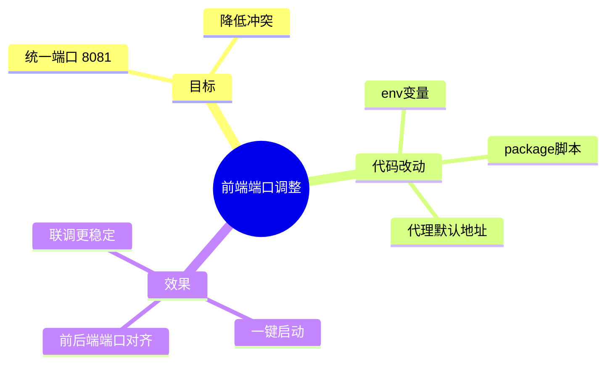

# 2026-02-28 前端端口调整（8081）

## 1. 本次改动

- 前端开发端口从 `3000` 改为 `8081`。
- 前端启动脚本直接固化端口，避免每次手动带参数。
- 前端到后端的默认代理地址改到 `http://127.0.0.1:8090`。

## 2. 改动文件

- `frontend/package.json`
  - `dev` 改为 `next dev --hostname 0.0.0.0 --port 8081`
  - `start` 改为 `next start --hostname 0.0.0.0 --port 8081`
- `frontend/.env.local`
  - `RAG_PYTHON_URL=http://127.0.0.1:8090`
- `frontend/src/app/api/_shared/proxy.ts`
  - 默认后端地址从 `8000` 改为 `8090`

## 3. 为什么这么改（大白话）

- 主公要看效果时，不希望和系统里常见的 3000 端口冲突。
- 端口写进脚本后，团队所有人一键 `npm run dev` 就统一在 8081。
- 前端代理默认和后端新端口对齐，减少“前端启动了但接口不通”的情况。

## 4. 思维导图

