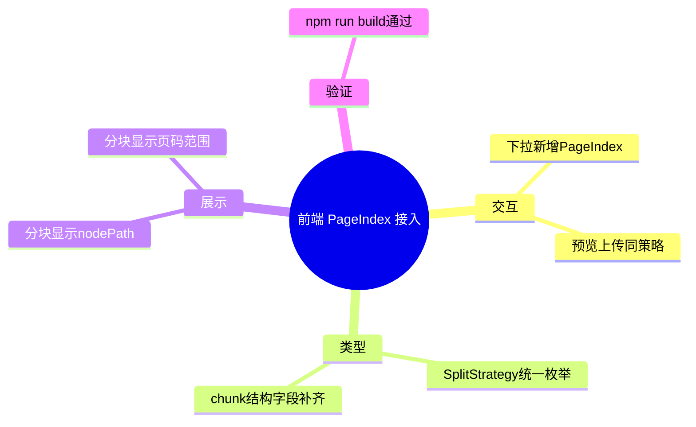

# 2026-03-01 PageIndex 切分策略接入（前端）

主公，这一版前端把 `PageIndex` 切分策略接进了文档页面，做到“能选、能传、能看结构信息”。

## 1. 这次改了哪些文件

1. `frontend/src/app/(workspace)/documents/page.tsx`
2. `frontend/src/types/rag.ts`
3. `frontend/src/lib/rag-api.ts`

## 2. 实现细节（大白话）

### 2.1 策略下拉新增 PageIndex

- 文档切分策略新增选项：`PageIndex`（值：`pageindex`）。
- 现在支持：`fixed/sentence/paragraph/parent_child/pageindex`。
- 选中后，预览和上传都走同一个策略参数。

### 2.2 前端类型补齐

- 新增 `SplitStrategy` 类型统一约束策略枚举。
- `SplitPreviewRequest.strategy`、`uploadDocument` 参数都改用 `SplitStrategy`。
- 分块结构补齐 PageIndex 字段：
  - `nodeId/nodePath/level`
  - `pageStart/pageEnd`
  - `charStart/charEnd`
  - `sectionTitle`

### 2.3 查看分块可视化增强

在“查看分块”弹窗里，若后端返回了 PageIndex 元数据，会额外展示：

- 章节路径（`nodePath`）
- 页码范围（`pageStart-pageEnd`）

这样主公看分块时，能直接知道“这段来自哪一章哪一页”。

## 3. 小赵两轮思考

### 第一轮：先打通参数链路

先保证页面状态、请求参数、类型定义三处一致，避免出现“UI 能选但请求没带上”的假接入。

### 第二轮：再做可解释展示

PageIndex 的价值在“结构可追溯”，所以前端必须把章节路径和页码直接展示出来，不然策略价值看不见。

## 4. 验证结果

已执行：

- `cd frontend && npm run build`

结果：

- Next.js 16.1.6 构建通过。
- TypeScript 检查通过。

## 5. 思维导图

