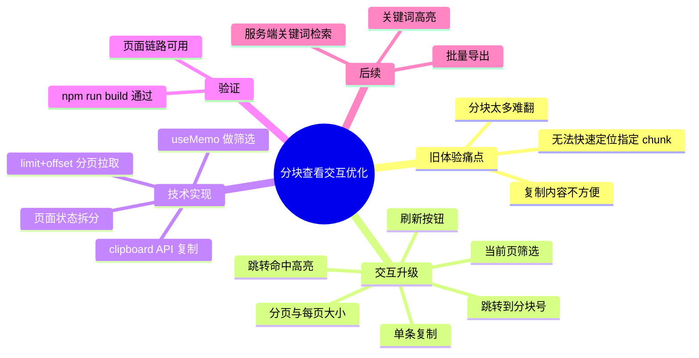

# 2026-03-01 文档分块查看交互优化

主公，这次主要把“查看分块”从单纯长列表，升级成可筛选、可分页、可跳转、可复制的交互。

## 1. 这次改了什么

- 分块弹窗宽度扩大到 960，减少左右挤压。
- 增加“当前页筛选”输入框，可按分块编号或内容关键字过滤。
- 增加“跳转到分块号”，可快速跳到指定 chunk。
- 增加分页器（10/20/50/100），支持大文档分块按页查看。
- 增加“刷新”按钮，方便处理状态变化后手动拉取。
- 每个分块增加“复制”按钮，便于问题定位和外部排查。
- 跳转命中的分块会高亮，减少视觉查找成本。

## 2. 对应代码文件

- `frontend/src/app/(workspace)/documents/page.tsx`
- `frontend/src/app/globals.css`

## 3. 实现细节（大白话）

### 3.1 以前的问题

- 弹窗里直接把分块一股脑列出来，文档稍大就很难翻。
- 想看某个 chunk 只能肉眼找，没有跳转。
- 想把分块内容贴给别人排查，还得手动选中复制。

### 3.2 这次怎么改

- 新增 `loadDocumentChunks(documentId, page, pageSize)`，分页请求后端 `/documents/{id}/chunks?limit&offset`。
- 页面状态新增：`chunksPage`、`chunksPageSize`、`chunksKeyword`、`jumpChunkIndex`、`activeChunkIndex`。
- 筛选逻辑做成“当前页过滤”，避免误以为全量搜索。
- 跳转逻辑：按 `chunkIndex` 计算目标页，再请求该页并高亮目标块。
- 复制逻辑：走 `navigator.clipboard.writeText`，给成功/失败消息提示。

### 3.3 样式侧怎么配

- 新增弹窗工具条布局 `chunks-modal__toolbar`。
- 新增分页区 `chunks-modal__footer`。
- 新增 `chunk-item--active` 高亮样式，命中跳转后更醒目。

## 4. 验证结果

已执行：

- `cd frontend && npm run build`

结果：

- Next.js 16.1.6 编译通过。
- TypeScript 检查通过。
- 文档管理页“查看分块”可正常分页、筛选、跳转、复制。

## 5. 小赵的思考

- 分块查看本质是“排障台”，不是“展示台”，必须优先保证定位效率。
- 先把基础交互做全（筛选/分页/跳转/复制），再考虑高阶功能（关键词高亮、全文检索、导出）。
- 这次先不做服务端全文检索，保持改动可控；后面可在后端补 `keyword` 参数再联动前端。

## 6. 思维导图

