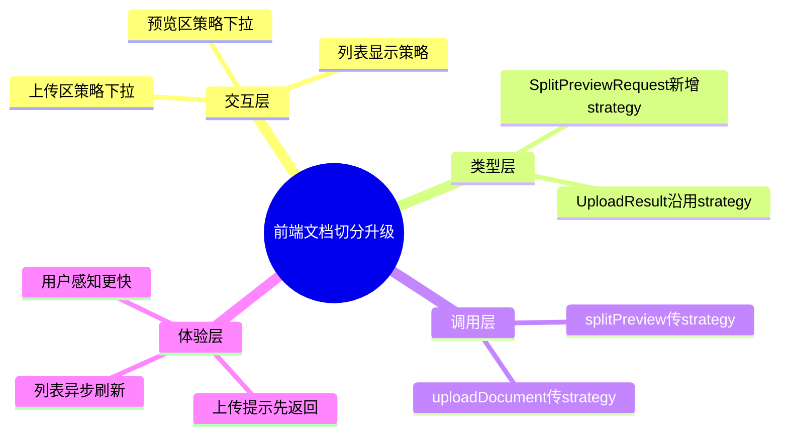

# 2026-03-01 文档切分策略可选与上传提速（前端）

主公，这一版前端是把“切分策略”从固定写死改成可选，并把上传后的反馈速度做得更快。

## 1. 这次改了哪些文件

1. `frontend/src/app/(workspace)/documents/page.tsx`
2. `frontend/src/lib/rag-api.ts`
3. `frontend/src/types/rag.ts`

## 2. 实现细节（大白话）

### 2.1 文档页新增“切分策略”下拉

- 上传区增加策略选择：`固定长度 / 按句切分 / 按段切分`。
- 预览区也增加同一个策略选择。
- 页面状态里新增 `splitStrategy`，默认 `fixed`。

### 2.2 预览请求带上策略

- `splitPreview(...)` 调用新增 `strategy` 参数。
- 这样预览结果和真实上传用的是同一套策略，不会“预览一种，入库另一种”。

### 2.3 上传请求带上策略

- `uploadDocument(file, strategy)` 默认值改为 `fixed`。
- 前端会把用户当前选择的策略随表单提交给后端。

### 2.4 上传后体验优化

- 上传成功后，文档列表刷新改为 `void loadDocuments("refresh")` 异步触发。
- 用户先看到“上传成功 + 任务号”，不用等列表刷新结束才有反馈。

### 2.5 列表展示策略字段

- 文档管理列表新增一行：`策略: xxx`。
- 用户能直接看到每个文档入库时采用的切分策略。

## 3. 小赵两轮思考

### 第一轮：先保证参数全链路一致

- UI、类型、API 封装同时补齐 `strategy`。
- 目标是“用户选什么，后端就收到什么”。

### 第二轮：再优化体感速度

- 把上传后的列表刷新改成不阻塞提示。
- 先提升感知速度，再考虑后续自动轮询等增强。

## 4. 思维导图

