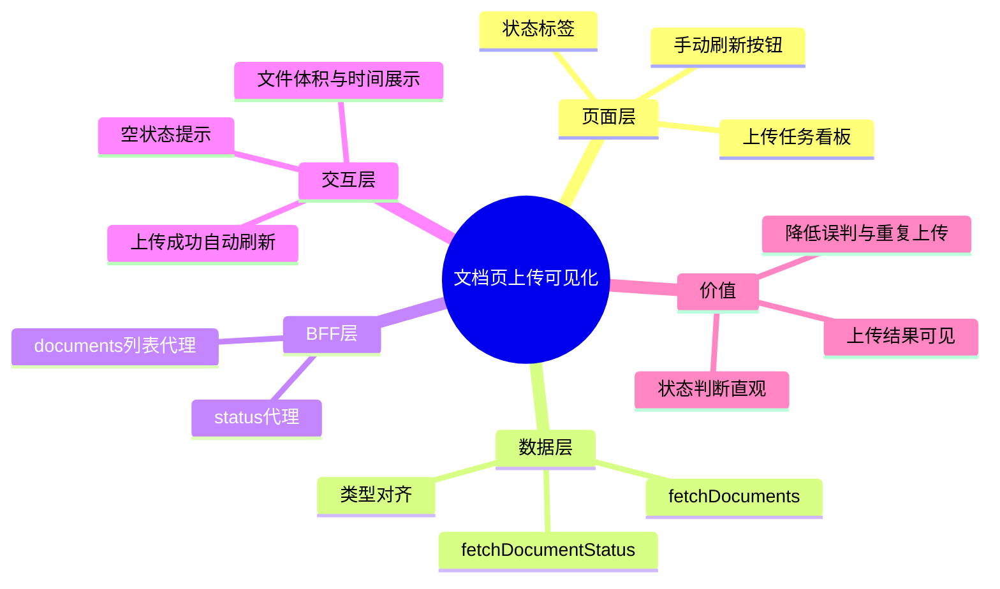

# 2026-03-01 文档页上传记录可视化（前端）

主公，这一版前端把“文档上传后看不见”的体验补齐了：

- 文档页新增“上传任务看板”，直接展示后端文档列表
- 上传成功后自动刷新列表，不用手动换页
- 支持手动刷新，状态标签清晰展示排队/处理中/完成/失败

## 1. 这次改了哪些文件

1. `frontend/src/app/(workspace)/documents/page.tsx`
2. `frontend/src/lib/rag-api.ts`
3. `frontend/src/types/rag.ts`
4. `frontend/src/app/api/v1/documents/route.ts`（新增）
5. `frontend/src/app/api/v1/documents/[documentId]/status/route.ts`（新增）
6. `frontend/src/app/globals.css`

## 2. 实现细节（大白话）

### 2.1 文档页新增列表区域

- 在页面下方新增“上传任务看板”卡片。
- 初次进入页面会请求 `fetchDocuments`，展示最近 30 条。
- 每条记录展示：
  - 文件名
  - 文档 ID
  - 文件体积
  - 上传时间
  - 策略与任务号

### 2.2 状态可视化

- 新增状态 Tag 映射：
  - `queued` -> 排队中
  - `processing` -> 处理中
  - `completed` -> 已完成
  - `failed` -> 失败
- 每个状态用独立颜色，用户一眼能看出处理进度。

### 2.3 上传后自动联动

- 上传成功后，除了提示任务号，还会立即调用 `loadDocuments("refresh")`。
- 这样用户上传完就能马上看到新文档，不会误以为上传失败。

### 2.4 BFF 与类型补齐

- 新增 Next.js BFF 路由：
  - `GET /api/v1/documents`
  - `GET /api/v1/documents/{id}/status`
- `rag-api.ts` 新增：
  - `fetchDocuments(status?, limit?)`
  - `fetchDocumentStatus(documentId)`
- `rag.ts` 补齐文档列表/状态的类型定义，前后端字段对齐。

## 3. 小赵思考

- 先把“可见性”做出来，比先做复杂进度条更重要。
- 当前看板是最近记录视图，后面可以继续扩展成分页、筛选、自动轮询。
- 这版不改上传协议，风险小，回归范围可控。

## 4. 思维导图

