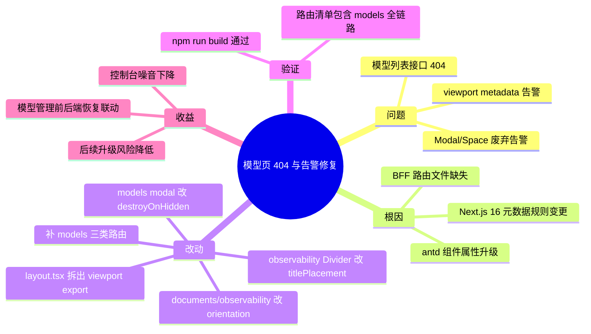

# 2026-03-01 模型 BFF 路由补齐与控制台告警修复

主公，这一轮主要解决三类前端问题：`/api/v1/models` 404、Next.js viewport 告警、antd 废弃属性告警。

## 1. 这次改了什么

- 补回模型管理的 BFF 路由：列表/新增、详情/编辑/删除、状态切换。
- 修复 Next.js 16 的 metadata viewport 写法：从 `metadata` 迁到独立 `viewport export`。
- 修复 antd 弃用属性：`Modal.destroyOnClose` 改 `destroyOnHidden`。
- 顺手补齐剩余 `Space direction` 迁移，改为 `orientation`。
- 兼容 antd 新版 Divider 类型：`orientation="left"` 改成 `titlePlacement="left"`。

## 2. 对应代码文件

- `frontend/src/app/layout.tsx`
- `frontend/src/app/(workspace)/models/page.tsx`
- `frontend/src/app/(workspace)/documents/page.tsx`
- `frontend/src/app/(workspace)/observability/page.tsx`
- `frontend/src/app/api/v1/models/route.ts`
- `frontend/src/app/api/v1/models/[modelId]/route.ts`
- `frontend/src/app/api/v1/models/[modelId]/status/route.ts`

## 3. 实现细节（大白话）

### 3.1 为什么会 404

模型页前端请求的是 `/api/v1/models`，但 Next.js App Router 下对应的 BFF 路由文件被删掉了，只有 `/api/v1/models/[modelId]/test` 还在，所以列表接口直接 404。

### 3.2 怎么补的

- 新增 `models/route.ts`：负责 `GET / POST`。
- 新增 `models/[modelId]/route.ts`：负责 `GET / PUT / DELETE`。
- 新增 `models/[modelId]/status/route.ts`：负责 `PATCH`。
- 都继续走统一 `proxyJson`，保持和文档、聊天模块一致。

### 3.3 Next.js viewport 告警怎么修

Next.js 16 不建议在 `metadata` 里写 `viewport`。改成：

- `export const metadata` 只保留 title/description 等元信息。
- 新增 `export const viewport: Viewport = { ... }`。

### 3.4 antd 告警怎么修

- `Modal`：`destroyOnClose` -> `destroyOnHidden`。
- `Space`：`direction="vertical"` -> `orientation="vertical"`。
- `Divider`：`orientation="left"` 在新版类型里不再合法，改 `titlePlacement="left"`。

## 4. 验证结果

已执行：

- `cd frontend && npm run build`

结果：

- Next.js 16.1.6 编译通过。
- TypeScript 检查通过。
- 构建产物里已出现 `/api/v1/models`、`/api/v1/models/[modelId]`、`/api/v1/models/[modelId]/status` 路由。

## 5. 小赵的思考

- BFF 路由文件缺失属于“看起来像后端挂了，实际是前端网关没接上”的高频坑，优先级要拉高。
- 对这种升级告警（Next.js/antd）要尽早迁移，不然后续版本很容易从 warning 变 error。
- 这次顺手做了同类清理，避免主公后面再被不同页面重复报警干扰排查。

## 6. 思维导图

