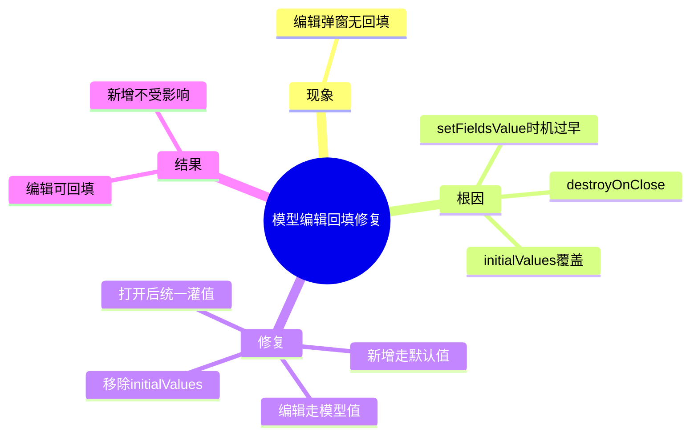

# 2026-03-01 模型编辑弹窗不回填修复

主公，这次是一个典型的表单生命周期问题：点“编辑”后弹窗打开，但字段没带出原模型数据。

## 1. 问题现象

- 在模型管理页点“编辑”。
- 弹窗能打开，但表单字段是空的或默认值，不是当前模型值。

## 2. 根因（大白话）

- 弹窗用了 `destroyOnClose`，关闭时表单会被销毁。
- 表单里又写了 `initialValues` 默认值。
- 之前逻辑是“先 `setFieldsValue`，再打开弹窗”。
- 弹窗重新挂载时，`initialValues` 把之前灌进去的数据覆盖了，所以看起来像“不回填”。

## 3. 修复方案

- 文件：`frontend/src/app/(workspace)/models/page.tsx`
- 调整为“弹窗打开后，根据模式统一灌值”：
  - 新增时：灌默认值。
  - 编辑时：灌当前模型值。
- 移除 `Form` 上的 `initialValues`，避免二次覆盖。

## 4. 改完后的效果

- 点“编辑”时，模型 ID、名称、提供商、能力、状态、Token、Base URL、API Key 都会正确回填。
- 点“新增”时，依然是默认空白/默认值，不影响原有体验。

## 5. 小赵思考

- 这类问题核心不是接口，而是“组件重建时机”和“表单默认值策略”。
- 后续弹窗表单尽量避免同时使用“销毁重建 + 固定 initialValues + 提前 setFieldsValue”三件套。

## 6. 思维导图

