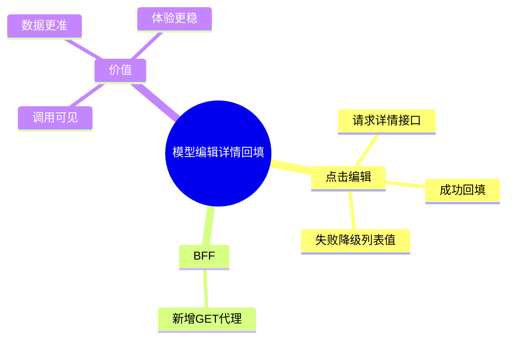

# 2026-03-01 模型编辑改为详情接口回填（前端）

主公，这次前端把“编辑模型”动作改成先请求后端详情，再回填弹窗。

## 1. 这次改动

- 新增前端调用：`fetchModelById(modelId)`
  - 文件：`frontend/src/lib/rag-api.ts`
- 新增 BFF 代理：
  - `GET /api/v1/models/[modelId]`
  - 文件：`frontend/src/app/api/v1/models/[modelId]/route.ts`
- 模型页编辑逻辑调整：
  - 点击编辑后会请求模型详情接口
  - 成功则用详情数据回填
  - 失败则降级用当前列表行数据并提示
  - 文件：`frontend/src/app/(workspace)/models/page.tsx`

## 2. 变化后的体验

- 网络面板会看到一条明确的 `GET /api/v1/models/{id}` 请求。
- 回填数据优先用后端最新值，不再完全依赖列表缓存。

## 3. 小赵思考

- 这个改动能同时满足两件事：
  - 主公可看到真实接口调用
  - 编辑表单拿到的是最新数据
- 即使接口偶发失败，页面仍可用，不会阻断编辑流程。

## 4. 思维导图

