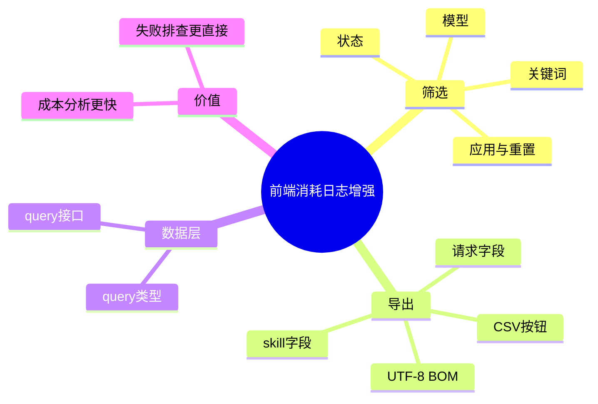

# 2026-03-01 消耗日志筛选与导出（前端）

主公，这一版前端在“消耗日志”页加了两个实用能力：筛选 + CSV 导出。

## 1. 新增功能

- 模型筛选：按 `modelId` 看某个模型的消耗。
- 状态筛选：只看成功或失败请求。
- 关键词筛选：按问题内容模糊查询。
- 导出 CSV：把当前列表导出，方便做成本复盘或给运营同学。

## 2. 具体改动文件

- `frontend/src/app/(workspace)/observability/page.tsx`
  - 增加筛选栏（模型、状态、关键词）
  - 增加 `筛选`、`重置`、`导出 CSV` 按钮
  - 导出内容包含请求级字段 + skill 级字段（一条 skill 一行）
- `frontend/src/lib/rag-api.ts`
  - 新增 `fetchConsumptionLogsByQuery(payload)`，支持带筛选参数请求
- `frontend/src/types/rag.ts`
  - 新增 `ConsumptionLogsQuery` 类型

## 3. 导出规则（大白话）

- 一个请求如果有 3 个 skill 调用，就导出 3 行。
- 请求信息会重复带上，这样拿到 Excel 后可直接按 skill 维度分析。
- CSV 带 UTF-8 BOM，中文在常见表格软件里不会乱码。

## 4. 小赵思考

- 先做“当前筛选结果导出”，比一次性导全量更稳，也更符合实际使用习惯。
- 筛选条件采用“草稿态 + 应用态”，避免每输入一个字就请求后端。

## 5. 思维导图

