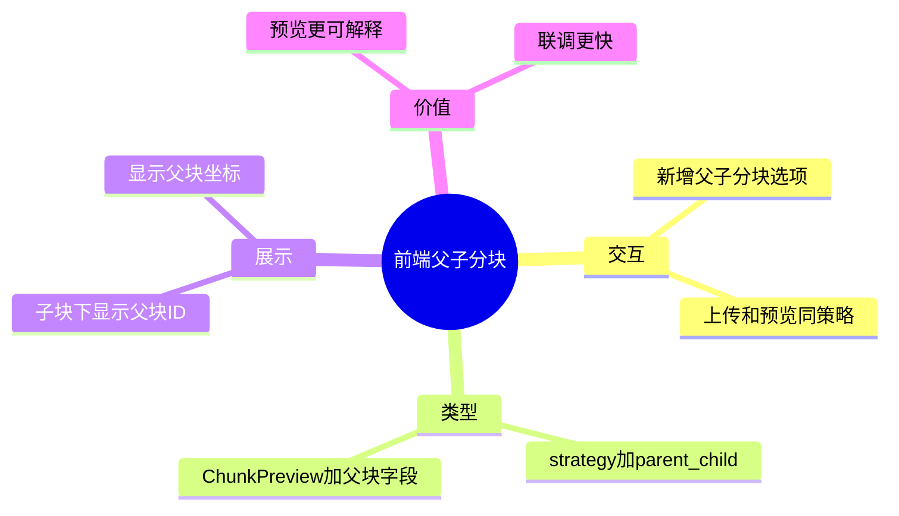

# 2026-03-01 父子文档切分策略接入（前端）

主公，这一版前端把“父子分块”完整接进文档页，能选、能传、能看父子关系。

## 1. 这次改了哪些文件

1. `frontend/src/app/(workspace)/documents/page.tsx`
2. `frontend/src/types/rag.ts`
3. `frontend/src/lib/rag-api.ts`

## 2. 实现细节（大白话）

### 2.1 策略下拉新增“父子分块”

- 上传区和预览区的策略下拉都新增：
  - `父子分块`（值：`parent_child`）
- 用户选了以后，预览和上传都走同一策略。

### 2.2 类型补齐

- `SplitPreviewRequest.strategy` 新增 `parent_child` 枚举值。
- `ChunkPreview` 新增可选父块字段：
  - `parentChunkId`
  - `parentStart`
  - `parentEnd`
  - `parentLength`

### 2.3 预览结果展示父块信息

- 当返回数据有 `parentChunkId` 时，在每条切片下面显示：
  - 父块 ID
  - 父块起止坐标
- 这样前端能直观看到“子块属于哪个父块”。

## 3. 小赵两轮思考

### 第一轮：先把策略端到端打通

- 页面状态、请求参数、类型约束一次补齐。
- 先保证不出现“下拉有选项，但请求没带上”的假接入。

### 第二轮：再做可视化解释

- 父子分块如果只看子块内容，调试成本高。
- 所以把父块信息直接放在预览项里，降低排障成本。

## 4. 思维导图

