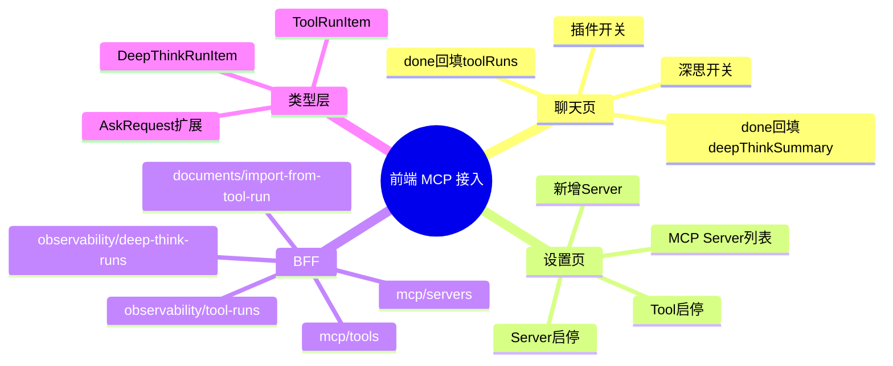

# 2026-03-01 聊天插件开关与 MCP 设置页

主公，这次前端重点不是“再做一个页面”，而是把插件能力真正接到用户操作里。

## 1. 这次前端做了什么

- 聊天页加了两个开关：
  - `插件`（自动工具调用）
  - `深思`（深度思考模式）
- 聊天流式完成后，页面会展示：
  - 插件调用记录（tool 名、状态、耗时）
  - 深度思考摘要
- 设置页从静态说明升级成可操作页：
  - MCP Server 列表
  - 新增 MCP Server
  - Server 启停开关
  - Server 同步工具按钮
  - Tool 启停开关

## 2. 主要改动文件

- `frontend/src/app/(workspace)/chat/page.tsx`
- `frontend/src/app/(workspace)/settings/page.tsx`
- `frontend/src/lib/rag-api.ts`
- `frontend/src/types/rag.ts`
- `frontend/src/app/api/v1/mcp/servers/route.ts`
- `frontend/src/app/api/v1/mcp/servers/[serverKey]/route.ts`
- `frontend/src/app/api/v1/mcp/servers/[serverKey]/sync-tools/route.ts`
- `frontend/src/app/api/v1/mcp/tools/route.ts`
- `frontend/src/app/api/v1/mcp/tools/[toolName]/status/route.ts`
- `frontend/src/app/api/v1/observability/tool-runs/route.ts`
- `frontend/src/app/api/v1/observability/deep-think-runs/route.ts`
- `frontend/src/app/api/v1/documents/import-from-tool-run/route.ts`

## 3. 聊天页行为变化

- 发问时会把开关状态一起发给后端：
  - `enableTools`
  - `enableDeepThink`
- `ask-stream` 的 `done` 事件新增字段：
  - `toolRuns`
  - `deepThinkSummary`
  - `deepThinkRuns`
- 前端不改现有流式逻辑，只在 `onDone` 阶段把新增字段回填到消息卡片。

## 4. 设置页行为变化

- 可以新增外部 MCP Server（serverKey/name/endpoint/timeout）。
- 每个 Server 可以点击“同步工具”，从外部服务刷新工具列表。
- 可以直接启停 Server 和 Tool。
- 这样主公不用改数据库，页面就能控制插件路由开关。

## 5. 类型和 API 怎么扩的

- `AskRequest` 新增：
  - `enableTools?: boolean`
  - `enableDeepThink?: boolean`
  - `maxToolSteps?: number`
- 新增类型：
  - `ToolRunItem`
  - `DeepThinkRunItem`
  - `McpServerItem`
  - `McpToolItem`
- `rag-api.ts` 增加 MCP/工具日志/一键入库相关调用函数。

## 6. 验证结果

- `npm run lint` 通过（仅保留项目原有 warning，无新增 error）。
- 前端走 BFF 流式请求时，可正常收到插件和深思附加数据。
- 设置页可拉到后端 MCP Server 与 Tool 列表并执行开关操作。

## 7. 小赵的实现思考

- 聊天页只加“必要可见项”，不做复杂编排 UI，避免把主流程搞重。
- 设置页先做“可控”优先：能开、能关、能看，先满足运维和联调。
- BFF 先补路由，再补更复杂权限策略，分层更稳。

## 8. 思维导图

