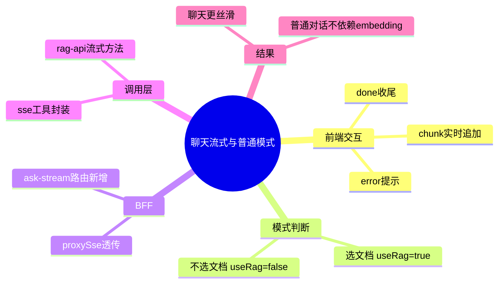

# 2026-03-01 聊天流式与普通对话模式

主公，这次把聊天链路改成了“能流式、能普通聊天”的双模式，重点是先把你说的两个痛点解决：

1. 对话要流式看到输出；
2. 没选文档时不该强制走 embedding。

## 1. 这次改了什么

- 前端聊天从一次性 `POST /chat/ask` 改成优先走流式 `POST /chat/ask-stream`。
- 聊天页发送请求时自动判断模式：
  - 选了文档：`useRag=true`
  - 没选文档：`useRag=false`（普通对话）
- 聊天消息气泡支持边收边渲染（chunk 到了就追加）。
- BFF 新增流式透传能力，不再把 SSE 当普通 JSON 处理。

## 2. 改动文件

- `frontend/src/app/(workspace)/chat/page.tsx`
- `frontend/src/lib/rag-api.ts`
- `frontend/src/lib/sse.ts`
- `frontend/src/types/rag.ts`
- `frontend/src/app/api/_shared/proxy.ts`
- `frontend/src/app/api/v1/chat/ask-stream/route.ts`

## 3. 实现细节（大白话）

### 3.1 流式怎么接

- 新增 `postSseJson()`，专门处理 `event: chunk/done/error`。
- 每收到一个 `chunk` 就把文本拼到当前 AI 气泡里。
- 收到 `done` 才收尾：更新 `sessionId` 和引用信息。

### 3.2 普通聊天不走 embedding

- 现在发送时根据“是否选文档”自动决定是否开 RAG。
- 不选文档就 `useRag=false`，直接普通聊天，不会触发向量检索链路。

### 3.3 BFF 为什么要改

- 之前代理默认是 JSON 思路，会把上游内容先解析。
- 现在新增 `proxySse()`，直接透传上游流，浏览器才能实时拿到 chunk。

## 4. 验证结果

已执行：

- `cd frontend && npm run build`

结果：

- 构建通过；
- 新路由 `/api/v1/chat/ask-stream` 已被编译识别。

## 5. 小赵思考

- 聊天体验里“首字延迟”比“总耗时”更敏感，先流式才像可用产品。
- RAG 是增强，不该变成普通对话的硬前置依赖。
- 这版先把模式切换自动化，后续可以再加“强制 RAG 开关”给高级用户。

## 6. 思维导图

