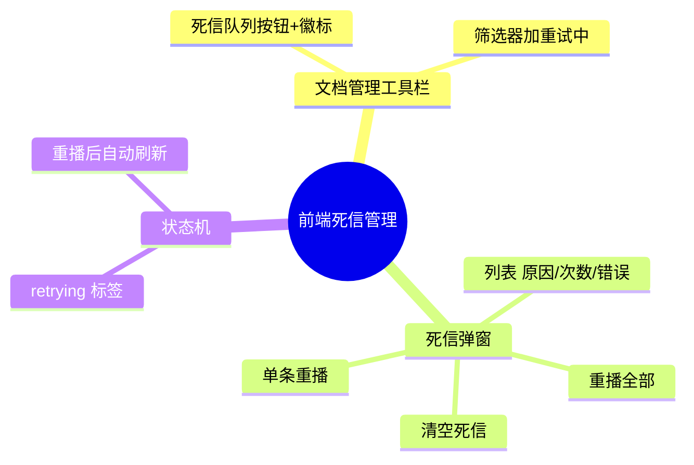

# 2026-09-16 死信队列管理入口与重试中状态

主公，这次把后端的重试/死信能力接到文档页：失败任务看得见、重播得了、清得掉，重试中的文档也有了自己的状态标签。

## 1. 这次解决了什么

- 文档管理工具栏新增「死信队列」入口，带实时徽标数，打开弹窗可：
  - 查看每条死信：文件名、失败原因（业务失败/重试耗尽/非法消息）、重试次数、错误类型与信息、入队时间。
  - 单条重播、全部重播（重试次数清零重新入队）、清空死信（二次确认）。
- 文档状态新增 `retrying`（重试中，旋转图标），筛选器同步加「重试中」选项。
- 重播后自动刷新文档列表，状态流转（queued → processing → …）实时可见。

## 2. 主要改动文件

- `frontend/src/app/api/v1/documents/dlq/route.ts`（新增）：GET/DELETE BFF 代理。
- `frontend/src/app/api/v1/documents/dlq/replay/route.ts`（新增）：POST BFF 代理。
- `frontend/src/lib/rag-api.ts`：`fetchDocumentsDlq` / `replayDocumentsDlq` / `purgeDocumentsDlq`。
- `frontend/src/types/rag.ts`：`DlqItem` / `DlqListResult` / `DlqReplayResult`。
- `frontend/src/app/(workspace)/documents/page.tsx`：状态标签、筛选项、死信队列按钮 + 管理弹窗。

## 3. 交互细节

- 挂载时只拉 `limit=1` 获取死信总数（后端按声明时的 message_count 返回 total，避免整队列检视）；打开弹窗才拉全量。
- 清空死信与重播全部都走 Popconfirm 二次确认，文案说明后果（清空 = 永久丢弃；重播 = 重新入队）。
- `payloadValid=false` 的非法消息体展示「消息体非法」标签，重播接口会自动跳过它们。

## 4. 验证结果

- `npx tsc --noEmit` 通过；eslint 无新增告警（仅存在既有的 `estimated` 未使用 warning）。
- BFF 联调：`GET /api/v1/documents/dlq` 返回 total；`POST replay` 不匹配过滤词时正确 skippedUnmatched 且消息回队。
- 浏览器实测：文档管理 tab 徽标显示死信数，弹窗列表/重播/空态渲染正常（截图核验）。

## 5. 思维导图

