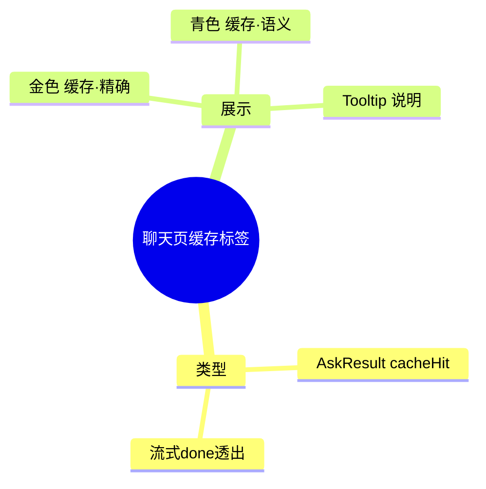

# 2026-09-16 聊天页缓存命中标签

主公，这次把后端的答案缓存状态透出到聊天界面：命中缓存的回答一眼可辨。

## 1. 这次解决了什么

- AI 回答气泡头部新增缓存命中标签：
  - 金色 ⚡「缓存·精确」：完全相同的问题命中缓存，跳过检索与生成。
  - 青色 ⚡「缓存·语义」：相似问题命中缓存（语义匹配），跳过生成。
- 悬停标签有 Tooltip 说明命中含义。

## 2. 主要改动文件

- `frontend/src/types/rag.ts`：`AskResult` 增加 `cacheHit/cacheKind/cacheSimilarity`。
- `frontend/src/lib/rag-api.ts`：流式 done 事件类型补缓存字段。
- `frontend/src/app/(workspace)/chat/page.tsx`：`ChatTurn` 增加 `cacheKind`，done 回调写入，气泡头部渲染标签。

## 3. 验证结果

- `npx tsc --noEmit` 通过，eslint 无新增告警。
- 浏览器实测（模型指向本地 mock）：同一问题连问两次，第一次无标签，第二次显示金色「缓存·精确」，引用来源正常展示，布局无错乱。

## 4. 思维导图

